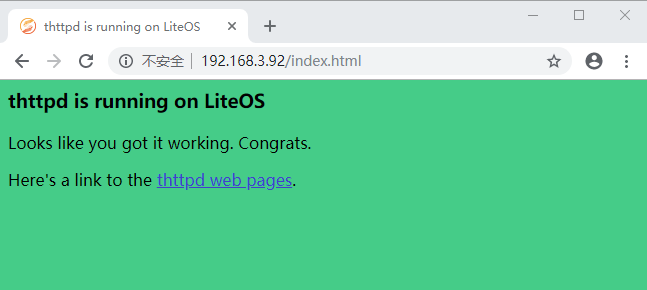

# Thttpd 使用手册
`Thttpd`是一个由C语言编写的轻量级web server，详情请参考<a href="https://github.com/nplab/thttpd.git">thttpd</a>。

目前仅`Cloud_STM32F429IGTx_FRIE`开发板支持`Thttpd`，下面以该开发板为例，讲解如何在`LiteOS`的`shell`命令行运行`Thttpd`，使客户端浏览器可以访问该`web server`。 

## 使能shell和Thttpd

在LiteOS源码根目录下运行`make menuconfig`命令，按如下菜单路径使能`shell`和`thttpd`组件： 

1.使能`shell`

```
Debug  ---> [*] Enable a Debug Version ---> [*] Enable Shell
```

2.使能`thttpd`

```
Components  ---> Utility ---> [*] Enable Thttpd
```

使能`Thttpd`组件后会自动使能所依赖的`Lwip`组件和`FATFS`组件，`FATFS`文件系统默认使用`SD`卡存储模式。

保存退出后，会从github上自动下载`Thttpd`源码，并从gitee上下载适配于LiteOS系统的patch包，并打入patch。详细流程在`components/download.sh`文件中。

**注意：** 下载需要Linux主机可以访问互联网，并安装`git`。

## 编译烧录

操作步骤如下：

1.在[thttpd-2.27/config.h](/components/utility/thttpd/thttpd-2.27/config.h)文件中设置`web server`端的web根目录（其中/fatfs为FATFS文件系统的挂载点，不支持修改），地址（与开发板的`IP`地址保持一致），端口（端口范围1-65535，设置其中一个未被占用的端口即可）等信息。本示例设置如下：

```
#define THTTP_WWWROOT_DIR "/fatfs/wwwroot"
#define THTTPD_IPADDR     (192<<24|168<<16|3<<8|92)
#define THTTPD_PORT       80
```

2.在SD卡的根目录中新建web根目录，例如根据步骤1中的默认设置，应创建名为`wwwroot`的文件夹。

3.将[thttpd/index.html](/components/utility/thttpd/figures/index.html)，[thttpd/favicon.ico](/components/utility/thttpd/figures/favicon.ico)文件拷贝到web根目录下。

4.将SD卡插入开发板的卡槽内。

5.将路由器与开发板网口连接。

6.在LiteOS源码根目录下执行`make clean ; make -j`命令编译LiteOS工程，编译成功后将在`out/Cloud_STM32F429IGTx_FIRE/lib`目录下生成组件静态库文件`libthttpd.a`，系统镜像文件为`Huawei_LiteOS.bin`。 烧录系统镜像文件到开发板后，复位重启开发板，查看`Thttpd`组件是否已经运行：

使用串口调试工具，进入`shell`命令行界面，输入`help` 命令，如果显示`thttpd`命令，则表示已经生效。

```
Huawei LiteOS # help
*******************shell commands:*************************

date       free       help       hwi       log        memcheck        swtmr        systeminfo    task       thttpd     uname      watch         

Huawei LiteOS # 
```

## Thttpd测试说明

1.在开发板的`shell`命令行界面中执行`thttpd`命令，启动`web server`，此时可以在开发板串口上看到如下信息输出，表示已经成功启动`web server`：

```
Huawei LiteOS # thttpd
file system mount success

thttpd/2.27 19Oct2015 starting on port 80
Huawei LiteOS # 
```

2.打开客户端浏览器请求`web server`端目标页面（本示例为 192.168.3.92:80/index.html），浏览器获取页面如下：


