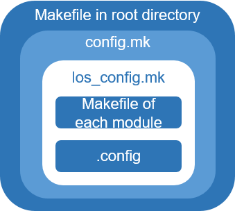

# Introduction to the Configuration and Build Framework

Huawei LiteOS uses the Kconfig file to configure systems and implements component-based build based on GCC or makefile.

Regardless of whether the  **make menuconfig**  command is used to configure the Linux system or Huawei LiteOS Studio is used for graphical configuration on Windows, Huawei LiteOS parses and displays the .config file and  **tools/menuconfig/config.in**  file \(which contains the Kconfig file of each module\) in the root directory at the same time, and generates the  **menuconfig.h**  file in the  **include**  folder of a development board. The  **config.in**  file is written in the Kconfig language \(a menu configuration language\). The  **config.in**  file determines configuration items to be displayed and the .config file determines the default value of each configuration item.

You can run the  **make**  command in the root directory to automatically build an entire project on Huawei LiteOS. The makefile file in the root directory contains  **config.mk**  and the  **config.mk**  contains  **los\_config.mk**. The  **los\_config.mk**  file contains the makefile and .config file of each module, defining the build and linking rules of an entire project.

Currently, Huawei LiteOS supports configuration and build on Windows and Linux platforms.

-   On a Windows platform, users can complete configuration and build in the Huawei LiteOS Studio graphical IDE.
-   On a Linux platform, users can use menuconfig to perform component-based configuration and tailoring, and run the  **make**  command to complete the build.

