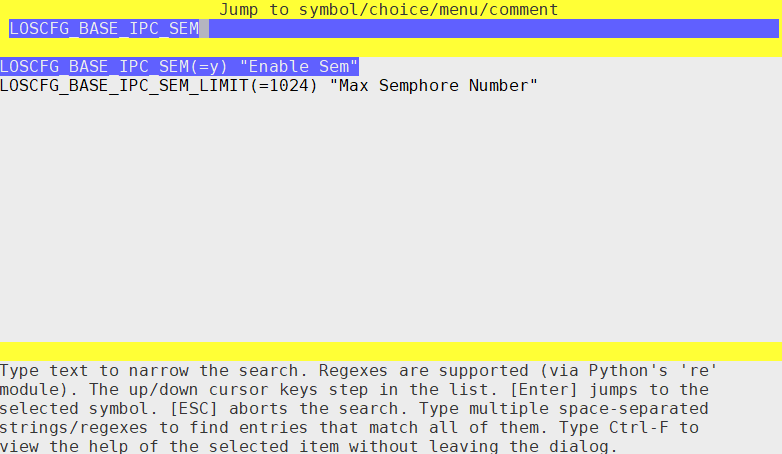

# Using the Configuration Tool on Linux

Run the  **make menuconfig**  command in the root directory of Huawei\_LiteOS to display the configuration GUI. You can tailor the module or modify the settings. After you save the settings and exit, the  **.config**  file in the root directory is updated.

menuconfig provides the following operation methods:

-   Up and down arrow keys: Select different rows and press the keys to move to different options.
-   Space or Enter key: Enable or disable an option.
    1.  Enable an option: If there is an asterisk in the brackets \[ \* \] in front of an option, the option is enabled.
    2.  Disable an option: If only brackets \[  \] are displayed in front of an option, the option is disabled.
    3.  If ---\> is displayed behind an option, the option contains sub-options. Press the space key or  **Enter**  key to go to the suboption. 

-   ESC key: Press this key to return to the upper-level menu or exit menuconfig and save the settings as prompted.

-   Question mark \(?\) : Displays the help information about a configuration item.
-   Slash \(/\): Go to the page for searching for configuration items. 
-   F: Enter the help mode. The help information about the configuration item is displayed in the lower part of the interface. Press  **F**  again to exit the help mode.
-   C: Enter the name mode. The macro switch of the configuration item is displayed. Press  **C**  again to exit the name mode.
-   A: Enter the all mode. All options in the menu are displayed. Press  **A**  again to exit the all mode.
-   S: save configuration items.
-   Q: Exit menuconfig and save the settings as prompted.

> **NOTE:** 
>-   The letters are case-insensitive. 
>-   You can press the slash key \(/\) to go to the search page, enter the macro definition of the configuration item to be searched for in the text box, for example, LOSCFG\_BASE\_IPC\_SEM. The configuration items matching the keyword are automatically displayed. Select the required configuration item and press  **Enter**.
>    

