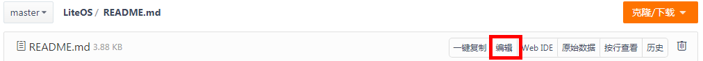
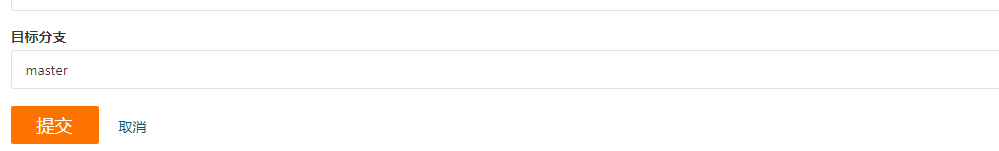

# Huawei LiteOS Code & Document Contribute Guide<a name="EN-US_TOPIC_0145347228"></a>

-   [Coding Standards](#Coding-Standards)
    - [General Principles](#General-Principles)
    - [Directory Structure](#Directory-Structure)
    - [Naming Conventions](#Naming-Conventions)
    - [Typesetting and Formatting](#Typesetting-and-Formatting)
    - [Comments](#Comments)
    - [Macros](#Macros)
    - [Header File](#Header-File)
    - [Data Types](#Data-Types)
    - [Variables](#Variables)
    - [Functions](#Functions)
    - [Portability](#Portability)
    - [Coding Standards in the Industry](#Coding-Standards-in-the-Industry)
-   [Document Writing Specifications](#Document-Writing-Specifications)
-   [Commit message Rules](#Commitmessage)
-   [Contribution Process](#Contribution-Process)
-   [Protocols](#Protocols)
-   [Join Us](#Join-Us)

<h2 id="Coding-Standards">Coding Standards</h2>
This standard is developed based on the general coding standards in the industry and is provided for developers for reference.

<h3 id="General-Principles">General Principles</h3>

- Clarity: easy to maintain and refactor
- Conciseness: easy to understand and implement
- Consistent code style
- Universality: compiling with the general coding standards in the industry

<h3 id="Directory-Structure">Directory Structure</h3>
You are advised to divide the project directories by referring to the LiteOS functional module division, and then define the header file directory and source file directory in the directories.

<h3 id="Naming-Conventions">Naming Conventions</h3>

- CamelCase is the practice of writing compound words or phrases so that each word or abbreviation in the phrase begins with a capital letter, with no intervening spaces or punctuation.
    | Type | Naming Style | Format |
    | --------------------------- | -------------------------------- | ------------------------- |
    | Functions and customized types | UpperCamelCase with or without a module prefix | AaaBbb, XXX_AaaBbb |
    | Local variables, function parameters, macro parameters, structure members, and union members | lowerCamelCase | aaaBbb |
    | Global variables | lowerCamelCase with the prefix 'g_' | g_aaaBbb |
    | Macros, enumerated values | All-capitalized words separated by underscores (\_) | AAA_BBB |
    | Macro variables that prevent duplicate kernel header files | All-capitalized module name with the prefix '_LOS' and suffix 'H', separated by underscores (\_) | \_LOS_MODULE_H |
- Names of global functions, global variables, macros, types, and enumerations shall be accurate and globally unique.
- Names of local variables or structure or union member variables should be as short as possible on the premise that related meanings can be accurately expressed.
- External LiteOS APIs are in the LOS_\<Module\>\<Func\> format. For example:

    ```
    LOS_TaskCreate
    LOS_SwtmrStart
    LOS_SemPend
    ```
    APIs between internal modules in the kernel directory are in the Os\<Module\>\<Func\> format. For example: 
    ```
    OsTaskScan
    OsSwtmrStart
    ```

    Low-level APIs provided by the arch directory for upper-layer modules are in the Arch\<Module\>\<Func\> format.
   In other cases, \<Module\>\<Func\> can be used.

<h3 id="Typesetting-and-Formatting">Typesetting and Formatting</h3>

-   A program block is indented with spaces instead of tabs ('\t'). Four spaces are used for each indentation level.
-   The K&R alignment style is used for braces. That is, the left brace of a function starts a new line and exclusively occupies the line. The other left braces follow statements and are placed in the end of a line.
    The right brace starts a new line and nothing else is placed on the line, unless it is followed by the remaining part of the same statement, for example, else or else if or semicolon in the if statement. For example:
    ```c
    struct MyType {   // The left brace is placed at the end of the statement, with a space left between them.
        ...
    };                // The right brace is followed by a semicolon (;).
    ```
    ```c
    int Foo(int a)
    {                 // The left brace of the function starts a new line and exclusively occupies the line.
        if (a > 0) {  // The left brace is placed at the end of the statement, with a space left between them.
            ...
        } else {      // The right brace, "else", and subsequent left brace are in the same line.
            ...
        }             // The right brace exclusively occupies the line.
        ...
    }
    ```
-   Braces are used in conditional or loop statements. For example:
    ```c
    if (objectIsNotExist) { // Braces are added to a single-line conditional statement.
        return CreateNewObject();
    }
    ```
    ```c
    while (condition) {} // Braces are used even if the loop body is empty.
    ```
    ```c
    while (condition) {
        continue;        // Braces are used even if the continue indicates the empty logic.
    }
    ```
- The case or default statement is indented by one level in a switch statement. For example:
    ```c
    switch (var) {
         case 0:             // The statement is indented by one level.
            DoSomething1(); // The statement is indented by two levels.
            break;
        case 1:
            DoSomething2();
            break;
        default:
            break;
    }
    ```
-   Only one statement is written in a line.
-   It is recommended that a statement contain a maximum of 120 characters. If the statement cannot be shortened, it must be written in multiple lines.
-   When a line breaks, an operator is left at the end of the original line, and the new line is aligned by type or indented by one level. For example:
    ```c
    // Assume that the first line exceeds the length limit.
    if (currentValue > MIN &&  // After the line break, the Boolean operator is placed at the end of the line.
        currentValue < MAX) {  // The new line is aligned with the two operands of the (&&) operator.
        DoSomething();
        ...
    }
    ```
    ```c
    // Assume that the line for function calling exceeds the length limit.
    ReturnType result = FunctionName(paramName1,
                                     paramName2,
                                     paramName3); // Parameters are aligned with the preceding parameters.
    ```
    ```c
    ReturnType result = VeryVeryVeryLongFunctionName( // The first parameter is too long, resulting in a line break.
        paramName1, paramName2, paramName3);          // The line is indented with four spaces.
    ```
    ```c
    // If parameters represent a group of data structures with a strong correlation, they are placed in one line for ease of understanding. In this case, the understandability takes precedence over the formatting and typesetting requirements.
    int result = DealWithStructLikeParams(left.x, left.y,    // A group of related parameters.
                                          right.x, right.y); // Another group of related parameters.
    ```
-   When a function is declared or defined, the return type and other modifiers of the function are in the same line as the function name.
-   The pointer type "\*" should follow the variable or function name on its right-hand side. For example:
    ```c
    int *p1;  // Good example: The pointer type "*" follows a variable on its right-hand side, and leaves a space between itself and the type on its left-hand side.
    int* p2;  // Bad example: The pointer type "*" follows the type on its left-hand side.
    int*p3;   // Bad example: The pointer type "*" leaves spaces on neither sides.
    int * p4; // Bad example: The pointer type "*" leaves spaces on both sides.
    ```
    If there are other modifiers between the pointer type "\*" and the variable or function name, the pointer type "\*" does not follow the modifiers. For example:
    ```c
    char * const VERSION = "V100";    // Good example: When the const modifier exists, the pointer type "*" leaves spaces on both sides.
    int Foo(const char * restrict p); // Good example: When the restrict modifier exists, the pointer type "*" leaves spaces on both sides.
    ```
- Blank lines are properly arranged based on the context relevance. Do not use three or more consecutive blank lines.
-   The number sign (#) that starts a preprocessor directive is placed at the beginning of a line. The line does not need to be indented unless it is for a nested preprocessor directive. For example:
    ```c
    #if defined(__x86_64__) && defined(__GCC_HAVE_SYNC_COMPARE_AND_SWAP_16) // The number sign (#) is at the beginning of the line which is not indented.
        #define ATOMIC_X86_HAS_CMPXCHG16B 1                                 // The line is indented by one level to facilitate reading.
    #else
        #define ATOMIC_X86_HAS_CMPXCHG16B 0
    #endif
    ```

### Comments

-   Comments must be clear, accurate, and non-ambiguous.
-   Comments are used to express the function and intention of code, rather than repeating the code.
-   Comments in the function declaration describe the function, performance, and usage, including the input and output parameters, return values, and reentering requirements. Comments in the function definition detail the function and implementation points, such as the procedure, reason, and design constraints.
-   Detailed comments must be provided for global variables, including the function, value range, and access precautions.
-   Abbreviations should be avoided in comments unless they are commonly used in the industry or are standardized in subsystems.
-   Comments must be added to the file header. It is recommended that the comments contain the following information: copyright description, version number, generation date, author name, function description, relationship with other files, and modification log.
- The comment style must be unified. The /* */ format is recommended. There must be a space between the comment character and the content. The comment styles of a single line and multiple lines are as follows:
    ```c
    /* Single-line comment */
    ```
    ```c
    /*
     * Multi-line comment
     * Second line
     */
    ```
-   Comments should be placed above or to the right of the code.

    There is no blank line between the comment line and the code line. Indentations of the two lines are the same.
    There must be at least one space between the code and the comment on the right. It is more appealing sometimes when multiple comments placed on the right are aligned vertically. For example:
    ```c
    #define A_CONST 100         // The two comment lines are of the same type.
    #define ANOTHER_CONST 200   // The lines are left-aligned.
    ```

### Macros

-   The #ifdef macro is used to isolate code snippets. For example:
    ```c
    #ifdef LOSCFG_XXX
    ...
    #endif
    ```
-   When defining a macro, use complete parentheses. For example:
    ```c
    #define SUM(a, b) a + b       // Unqualified.
    #define SUM(a, b) ((a) + (b)) // Qualified.
    ```
    However, the abuse of parentheses should be avoided. For example, it is meaningless to add parentheses to a single number or identifier.
    ```c
    #define SOME_CONST  100         // Parentheses are not required for a single number.
    #define ANOTHER_CONST   (-1)    // Parentheses are required for negative numbers.
    #define THE_CONST   SOME_CONST  // Parentheses are not required for a single identifier.
    ```
-   The function-like macro implementation statements that contain multiple statements must be placed in do-while(0). For example:
    ```c
    #define FOO(x) do { \
        (void)printf("arg is %d\n", (x)); \
        DoSomething((x)); \
    } while (0)
    ```
-   Preprocessor directives are not allowed in arguments in macro calling.
-   The macro definition does not end with a semicolon (;).

<h3 id="Header-File">Header File</h3>

-   Design principles
    -   The responsibility of a header file should be simple.
    -   It is recommended that all .c files in a module be stored in one directory whose name is the module name. If a module contains multiple sub-modules, it is recommended that each sub-module provide an external .h file whose name is the sub-module name.
    -   It is recommended that each .c file have a .h file with the same name, which is used to declare the APIs that need to be exposed externally.
    -   The header file is suitable for placing API declarations instead of implementations.
    -   Variables cannot be defined in the header file.
    -   Cyclic dependency of header files is forbidden. Cyclic dependency means that a.h contains b.h, b.h contains c.h, and c.h contains a.h.
    -   Header files should be self-contained. That is, any header file can be compiled independently. In addition, unnecessary header files should not be included.
    -   Header files must have #define guards to prevent multiple inclusions. For example, the following macro definition guards are used in the kernel:
        ```c
        #ifndef _LOS_<MODULE>_H  // For example, _LOS_TASK_H
        #define _LOS_<MODULE>_H
        ...
        #endif
        ```
    -   External function APIs or variables cannot be referenced in declaration. APIs provided by other modules or files can be used only by including header files.
    -   Header files cannot be included in extern "C".
    -   Header files are included in a reasonable sequence:

        1\) Header file corresponding to the source file

        2\) C standard library

        3\) Other OS header files to be included
-   Copyright Statement
    -   The copyright statements of header files are the same and placed on the top of each header file.
    -   If the submitted code is compiled or derived based on the open-source software, comply with the open-source license agreement and fulfill the license obligations of the modified software.

<h3 id="Data-Types">Data Types</h3>
Use types defined in los_typedef.h to define basic types. For example, use UINT32 to define an unsigned 32-bit integer variable.

### Variables
-   Use a variable for only one purpose.
-   Local and global variables must have different names.
-   Do not use global variables if possible.
-   When defining local variables of a function, limit the space occupied by variables to prevent program running failures due to excessive stack space occupation. For example, if a large array is required, you can dynamically allocate the memory to avoid occupying too much stack space.
-   Initialize variables before using them for the first time.
-   After a resource is released, a new value is immediately assigned to a variable that points to a resource handle or descriptor. The variables include the pointer, socket descriptor, file descriptor, and other variables that point to the resource.
-   The address of a local variable cannot be returned outside its scope. The following is a **bad example:**
    ```c
    int *Func(void)
    {
        int localVar = 0;
        ...
        return &localVar;  // Bad example
    }

    void Caller(void)
    {
        int *p = Func();
        ...
        int x = *p;       // The program generates undefined behavior.
    }
    ```
    **Good example:**
    ```c
    int Func(void)
    {
        int localVar = 0;
        ...
        return localVar;
    }

    void Caller(void)
    {
        int x = Func();
        ...
    }
    ```
-   If you want to use the variables of other modules, do not directly access the variables. Instead, use the unified function encapsulation or macro encapsulation mode. For example, in the mutex module:
    ```c
    // Introduce global variables in the private header file. Do not use them directly.
    extern LosMuxCB *g_allMux;
    // Access g_allMux in GET_MUX mode.
    #define GET_MUX(muxID)  (((LosMuxCB *)g_allMux) + GET_MUX_INDEX(muxID))
    ```

### Functions

-   Duplicate code should be extracted into functions as much as possible.
-   Avoid long functions and ensure that each function contains no more than 50 lines.
-   Inline functions must be as short as possible and cannot exceed 10 lines (non-null and non-comment).
-   Avoid deep code block nesting.
-   Do not use global variables, static local variables, or I/O operations in functions. If necessary, use them in a centralized manner.

### Portability
Do not use statements that are closely related to hardware or operating systems. Instead, use recommended standard statements to improve software portability and reusability.

<h3 id="Coding-Standards-in-the-Industry">Coding Standards in the Industry</h3>
There are many references to the C coding standards. You can learn them by yourself.

<h2 id="Document-Writing-Specifications">Document Writing Specifications</h2>

Huawei LiteOS \(hereinafter referred to as "LiteOS"\) welcomes developers to contribute to the open-source community. If contributors want to commit document changes or new documents, please refer to the following specifications.

### Naming

To commit a new document, create the .md file under the **doc** directory of <a href="https://gitee.com/LiteOS/LiteOS" target="_blank">the LiteOS code on Gitee</a>. The file name must be in the **xxx_xxx.md** format.

For example, a document that describes writing specifications can be named  **LiteOS\_doc\_write\_standard.md**.

### Content

The content should be concise and intuitive. Introductory documents describe principles, architecture, and design ideas in a concise manner, and operation documents describe key steps to help other developers. Chinese is preferred. It is recommended that both Chinese and English be supported. LiteOS will be updated continuously to ensure the synchronization between Chinese and English.

1.  **Title**

    It is recommended that the title have no more than three levels.

2.  **Body**
    -   Operation documents: Porting is used as an example to show the document structure.
        1.  Purpose \(Briefly describe the purpose of the operation, for example, the model of the board to which the port is to be migrated.\)
        2.  Hardware and software requirements
        3.  Detailed steps
        4.  Result verification

    -   Introductory documents: A feature in a development guide is used as an example to show the document structure.
        1.  Overview \(concepts and principles\)
        2.  Functions \(supported APIs\)
        3.  Development process \(steps of how to use and develop\)
        4.  Programming examples \(sample code\)
        5.  Precautions
        6.  Others

3.  **Images**

    Images are stored in the  **figures-en**  folder in the directory where the document is stored. For example, images used in **LiteOS/doc/quick\_start/LiteOS\_doc\_write\_standard.md** are stored in **LiteOS/doc/quick\_start/figures-en**, and relative paths are used to reference images in the document. It is recommended that images be named based on the content. Using only a number is difficult for image inheritance.

    > **NOTE:** 
    >Reference:
    >!\[\]\(./figures/figures-standard.png\)

    If a self-made image is used, refer to the following figure to configure the color. The format can be .png, .jpg, .gif, and so on. If a screenshot or an image referenced in other places is used, there is no restriction on the style.

    

4.  **Table**

    You can insert a table in the .md file in the following format:

    ```
    | Tables      | Type          | Note  |
    | ----------- |:-------------:| -----:|
    | first       | standard      |  None |
    | second      | outstanding   |     5 |
    | third       | inside        |  with |
    ```

5.  **Code**

    To insert a code segment in the body, add  **\`\`\`**  before and after the code segment. The following uses the C language as an example:

    <blockquote>
    ```c

    int size = 10;

    \```
    </blockquote>


<h2 id="Commitmessage">Commit message Rules</h2>

There are multiple commit message rules. LiteOS uses the Angular specification, which is the most widely used format. It is reasonable and systematic, and has matching tools.

<h3 id="Function-of-Commit-Messages">Function of Commit Messages</h3>

A formatted commit message has the following advantages:

- More historical information is provided for quick browsing.
- Certain commits (for example, document changes) can be filtered for easier search.
- Change logs can be directly generated from the commit operation.

<h3 id="Format-of-LiteOS-Commit-Messages">Format of LiteOS Commit Messages</h3>

Each commit message contains three parts: header, body, and footer.
```
<header>
Blank line
<body>
Blank line
<footer>
```

For example:
```
fix(stm32f411): fix stm32f411 migration guide file error

fix some error in stm32f411re migration guide file.

Close #75
```

- **Header Format**

    A header contains only one line and its format is as follows:
    ```
    <type>(<scope>): <subject>
    ```
    A header consists of three fields: type (mandatory), scope (optional), and subject (mandatory).

    - type

      type indicates the commit type. Only the following seven identifiers are allowed:
      ```
      feat: short for feature, indicating a new function

      fix: bug fixing

      docs: short for documentation, indicating document changes

      style: format changes without affecting code running

      refactor: refactoring (neither function adding nor bug fixing)

      test: new testing

      chore: changes to build processes or tools
      ```

    - scope

      scope indicates the scope affected by the commit operation. For example, if the base modification of the LiteOS kernel affects all code, set **scope** to **all**. If only stm32f411 is modified, set **scope** to **stm32f411**.

    - subject

      subject provides a short description of the commit purpose, which contains a maximum of 50 characters. subject starts with a verb and use the first-person present tense. For example, use **change** instead of **changed** or **changes**. The first letter of subject is in lowercase, and no period (.) is added at the end.

- **Body Format**

    A body describes the commit operation in detail. Multiple lines can be used.
    ```
    Add porting contest board projects to LiteOS
    Board list:
    Arduino-M0-PRO
    ATSAM4S-XPRO
    ATSAMD21-XPRO
    EFM32-SLSTK3400A
    EFM32-SLSTK3401A
    EFM32-STK3700
    FRDM-KL26Z
    FRDM-KW41Z
    ```

    Note:

    - Use the first-person present tense. For example, use **change** instead of **changed** or **changes**.

    - Explain the motivation of code changes and the comparison with previous behavior.


- **Footer Format**

    A footer is used only in the following two scenarios:

    - Incompatible changes

      If the current code is incompatible with the previous version, the footer starts with **BREAKING CHANGE**, followed by the change, change reason, and migration method.
      ```
      BREAKING CHANGE: isolate scope bindings definition has changed.

         To migrate the code follow the example below:

         Before:

      scope: {
            myAttr: 'attribute',
         }

      After:

      scope: {
       myAttr: '@',
      }
      The removed `inject` wasn't generaly useful for directives so there should be no code using it.
      ```

    - Close Issue

      If the current commit operation is performed for an issue, you can close the issue in the footer.
      ```
      Closes #16, #24, #92
      ```

### Reference

For more details on commit message rules, see the original specifications: <a href="https://github.com/mychaser/docgather/blob/master/GitCommitMessageConventions.pdf" target="_blank">Angular specification</a>.


<h2 id="Contribution-Process">Contribution Process</h2>

LiteOS code repository is hosted on Gitee. Therefore, a code contributor needs to register an account with Gitee to contribute code. For details about how to register an account, see <a href="https://gitee.com/help/articles/4113#article-header0" target="_blank">Registering a Gitee Account</a>.

Code contributions can be classified into **online changes** and **local committing**.

### Method 1: Online Changes

Online changes are applicable to scenarios with a small number of changes. You can click **Edit** to go to the editing page.



After editing, click **Commit** at the bottom of the page to commit changes to the LiteOS project and then wait for the review.



### Method 2: Local Committing

The LiteOS code contribution process is as follows:

1.  Download the Git tool.
2.  Configure the SSH public key.
3.  Configure the local Git account.
4.  Fork LiteOS source code.
5. Synchronize the code from the LiteOS repository to the forked repository.
6.  Commit the local changes to the forked repository.
7.  Commit a pull request to the official LiteOS main repository.
8.  Check the pull request status.

#### **1 Downloading the Git Tool**

Download Git from the <a href="https://git-scm.com/download" target="_blank">official website</a>. For details about how to install it, see the <a href="https://gitee.com/help/articles/4106#article-header0" target="_blank">Installation Guide</a>.


#### **2 Configuring the SSH Public Key**
1\) Check whether there is a local public key. If the public key exists, a pair of files similar to the following is returned. Generally, the file names are **id\_rsa** (key) and **id\_rsa.pub** (public key).

```
$ ls ~/.ssh
id_rsa id_rsa.pub
```

If no public key file is available in the system, run the following command to generate one. The public key file is stored in the **\~/.ssh** directory by default.

```
$ ssh-keygen -t rsa -C "your-email@youremail.com"  // The email address is the one used for registering the Gitee account.
```

2\) Configure the SSH public key for the Gitee account. For details, see the <a href="https://gitee.com/help/articles/4191#article-header0" target="_blank">SSH Public Key Settings</a>.


#### **3 Configuring the Local Git Account**
The account information includes a username and an email address used for registering the Gitee account. The configured information is used for each Git committing.

```
$ git config --global user.name "your-username"
$ git config --global user.email "your-email@youremail.com"
```

If the account information has been stored on a local PC, choose **Control Panel** > **User Accounts** > **Credential Manager** to check whether the Gitee account password is correct. If it is incorrect, the code changes cannot be committed to a remote repository. If you cannot confirm or correct the account information on the local PC, run the following command to disable the local account and password:

```
$ git config --global --unset credential.helper
```

To view all Git configurations, run the following command:

```
$ git config --list
```


#### **4 Forking LiteOS Source Code**
1\) Log in to Gitee using your personal Gitee account.

2\) Go to the official LiteOS main repository (master branch): <a href="https://gitee.com/LiteOS/LiteOS" target="_blank">LiteOS source code repository</a>.

3\) Click **Fork** in the upper right corner to fork the LiteOS code to your account. In the dialog box that is displayed, select a personal account and click **OK**. Wait for a while. The LiteOS repository forked to your account is automatically displayed.


#### **5 Synchronizing the Code from the LiteOS Repository to the Forked Repository**

Before developing code, ensure that the LiteOS code in your account is consistent with that in the official LiteOS repository.  The official LiteOS repository may have been updated since the last code forking, so you need to synchronize the LiteOS repository code to the forked repository before code development. If the repository has just been forked, skip this step.


Click the icon in the red box in the preceding figure to pull code from the official LiteOS repository to the forked repository in your account. A dialog box is displayed, as shown in the following figure.


After you click **OK**, Gitee starts to synchronize the code. You do not need to perform other operations.


#### **6 Committing the Local Changes to the Forked Repository**


1\) Clone the code to the local PC.

```
git clone https://gitee.com/*Gitee account name*/LiteOS.git    // Address of the forked repository in your account. The default repository name is **origin**.
```

Create a local branch based on the LiteOS remote master branch and switch to the local branch. In the following example, the local branch name is **master**.

```
git checkout -b master origin/master
```

2\) Develop on your local branch. After the development is complete, run the **git add** and **git commit** commands to add and commit code, respectively, to the local repository. For details about the commit messages, see [LiteOS Commit Message Rules](#Commitmessage).

3\) Run the **git push origin master** command to commit the code to the master branch of your Gitee account.

**Note:** If you are unfamiliar with the git commands, search for references in the Internet.


#### **7 Committing a Pull Request to the Official LiteOS Main Repository**

After the preceding steps are performed, the changes have been committed to your remote repository. Then, you can commit a pull request to the master branch of the official LiteOS main repository on Gitee.

1\) Go to the forked LiteOS repository page in your account and click **+ Pull Request** as shown below.


2\) On the displayed page, select the source branch and set target branch to the master branch of the official LiteOS main repository, as shown below.


If the code does not conflict, a message in green is displayed, indicating that the code can be automatically merged, as shown in the following figure. Otherwise, you need to resolve the conflict first. For details about how to resolve code conflicts online, see <a href="https://gitee.com/help/articles/4305" target="_blank">Resolving Code Conflicts Online</a>.


Enter the title and description and click **Create** to commit a pull request. The reviewer, tester, milestone, tag, and priority on the right of the page are optional for creating a pull request.

> **NOTE:**
>-   If the committed code is used to resolve an issue, link the issue to the code. For details, see <a href="https://gitee.com/help/articles/4141" target="_blank">Linking a Commit to an Issue</a> and <a href="https://gitee.com/help/articles/4142" target="_blank">Linking a Pull Request to an Issue</a>.
>-   If there is new comment in the committed pull request, reply to the comment and @ the person who leaves the comment to tell them that the issue is solved.


#### **8 Checking the Pull Request Status**
1\) Go to the <a href="https://gitee.com/LiteOS/LiteOS" target="_blank">LiteOS main repository</a>.

2\) Click **Pull Requests** to display all pull requests in the LiteOS repository.


**Open** indicates that the code of the pull request is not merged. **Merged** indicates that the code has been merged. **Closed** indicates that the code is closed without being merged.

After the code changes are reviewed and approved by the LiteOS main repository administrator, they will be merged. Congratulations! You are a contributor now. Thank you for your contribution to the open-source community.


## Protocols

### Creative Commons License

**You are free to:**

**Share**  — copy and redistribute the material in any medium or format

**Adapt**  — remix, transform, and build upon the material

The licensor cannot revoke these freedoms as long as you follow the license terms.

**Under the following terms:**

**Attribution**  — You must give appropriate credit, provide a link to the license, and indicate if changes were made. You may include this attribution in any reasonable manner, but not in any way that suggests the licensor endorses you or your use.

**NonCommercial**  — You may not use the material for commercial purposes.

**ShareAlike**  — If you remix, transform, or build upon the material, you must distribute your contributions under the same license as the original.

**No additional restrictions**  — You may not apply legal terms or technological measures that legally restrict others from doing anything the license permits.

**Notices:**

You do not have to comply with the license for elements of the material in the public domain or where your use is permitted by an applicable exception or limitation.

No warranties are given. The license may not give you all of the permissions necessary for your intended use. For example, other rights such as publicity, privacy, or moral rights may limit how you use the material.

> **NOTICE:** 
>This is a human-readable summary of \(and not a substitute for\) the license. Visit [https://creativecommons.org/licenses/by-nc-sa/3.0/legalcode](https://creativecommons.org/licenses/by-nc-sa/3.0/legalcode)  for the complete license.

### Intellectual Property Rights \(IPRs\) Policy

1.  Definitions

    **1.1 Affiliate**: refers to, with respect to an entity, any other entity that directly or indirectly controls, is controlled by or is under common control with such entity, where "control" means the possession, direct or indirect, of the power to own or hold more than fifty percent \(50%\) of such entity, whether through ownership of voting rights or equity of owners with decision-making rights.

    **1.2 Compliance software:**  refers to Huawei LiteOS, which is officially released by Huawei Technologies Co., Ltd. \(hereinafter referred to as "Huawei"\) and has not been modified, or Huawei LiteOS that has been modified but can pass the certification test.

    **1.3 Certification test:**  refers to the test developed by Huawei to ensure the compatibility and interface consistency of the software or hardware used together with Huawei LiteOS. The certification test suite and related requirements and guides will be released on the Huawei LiteOS official website.

    **1.4 Contribution:**  refers to any information or materials submitted by any person to Huawei LiteOS for inclusion or proposed inclusion, including software source code, documents, or related materials.

    **1.5 Contributor:**  refers to a person who makes contributions to Huawei LiteOS.

    **1.6 You:**  refers to any individual, company, enterprise, cooperative enterprises, joint holding company, limited partnership, association, limited liability company, or entity.

    **1.7 Huawei LiteOS:**  refers to a lightweight open-source operating system \(OS\) developed, managed, and subject to updates by Huawei. Released on the Huawei LiteOS official website, it can be used in chip, gateway, smart home, IoT, and other domains.

    **1.8 Patent claim:**  refers to one or more claims in a patent or patent application, which satisfy the following conditions: the claim \(i\) is now or will be controlled by the contributor or its affiliates, or parties entitled to license without payment to an unrelated third party, and \(ii\) is inevitably and directly infringed if the recipient makes, uses, offers to sell, sells, imports, or otherwise transfers the contribution submitted by the contributor to Huawei LiteOS alone, or combines the contribution with the aforementioned Huawei LiteOS.

    **1.9 Policy:**  refers to Huawei LiteOS IPR policy.

    **1.10 Recipient:**  refers to an individual or legal entity who accepts this Policy and is licensed under this Policy.

    **1.11 Committer:**  refers to contributors and their affiliates.

2.  License Grant

    Huawei LiteOS code is licensed under BSD 3-Clause License, unless another applicable license is selected by Huawei. Recipients can access [http://opensource.org/licenses/BSD-3-Clause](http://opensource.org/licenses/BSD-3-Clause) to view detailed license information.

3.  Patent Non-prosecution Commitment

    3.1 Subject to the recipient's compliance with this Policy, if the recipient makes, uses, offers to sell, sells, imports, or otherwise transfers the compliance software, the committer agrees not to allege, suit, or bring other legal proceedings against the recipient for infringing the patent claim of the committer. The aforementioned commitment shall not apply to an allegation of infringement of a patent claim arising out of: \(i\) contributions submitted by other parties; \(ii\) changes made by others to the code contributed by the committer; \(iii\) the contribution combined with hardware or Huawei LiteOS code that is not the target of the contribution; or \(iv\) non-compliance software. The aforementioned commitment does not apply to compliance software integrated into personal portable products \(such as mobile phones, portable computers, and wearable devices\).

    3.2 This is the individual commitment of each committer to the recipient.

    3.3 Each committer understands and agrees that the patent non-prosecution commitment is legally binding and irrevocable \(except for those withdrawn under Article 4\) and that it is directed to the committer, its successor, the transferee, and any exclusive licensee entitled to enforce the commitment's patent claim against a third party are binding.

4.  License and Patent Non-prosecution Commitment Termination

    Subject to the provisions of the applicable license, if a recipient who is entitled to the patent non-prosecution interest under article 3 but has not terminated the interest under this article, makes, uses, offers to sell, sells, imports, or otherwise transfers the compliance software and causes direct infringement or aids infringement of the patent, and the contributor or its affiliates allege, suit, or bring other proceedings against the recipient, all license and patent non-prosecution commitments under this Policy of the recipient and its affiliates shall be terminated immediately.

5.  Other Rights

    5.1 This Policy does not grant the recipient a license to use Huawei's trade names, trademarks, service marks, or product names.

    5.2 No other express or implied patents, trademarks, copyrights or other intellectual property rights are granted to the recipients, whether by implication, waiver, estoppel or otherwise, except as expressly provided in this Policy and the License.

6.  Warranty Terms

    Unless otherwise specified by applicable laws or agreed by both parties in written form, Huawei LiteOS compliance software and any contributions are provided "AS IS" without warranties, express or implied, including but not limited to non-infringement, marketability, or warranties for specific purposes.

7.  Limitation of Liability

    Unless otherwise specified by applicable laws, Huawei and its affiliates or any contributors shall not be liable to any direct, indirect, special, or occasional loss or data loss caused by this Policy, or by using or not using Huawei LiteOS, even if contributors, recipients, or third parties have been advised of the possible loss.

8.  Severability

    To the extent that any provisions of this Policy are determined to be invalid, unenforceable, or in conflict with applicable laws, the other provisions of this Policy shall remain in force.

9.  Changes

    Huawei reserves the right to change this Policy at its sole discretion. The changed policy takes effect as of the date when it is published on the Huawei LiteOS official website, and applies only to Huawei LiteOS software versions that are released at the same time or later.

10. Governing Laws and Dispute Settlement

    This Policy shall be governed by and construed in accordance with the laws of the People's Republic of China. Any dispute arising out of or in connection with this Policy shall be submitted to the China International Economic and Trade Arbitration Commission. The arbitration award shall be final and binding upon both Parties.


<h2 id="Join-Us">Join Us</h2>

If you are interested in being Huawei LiteOS ecosystem partners, send an email to liteossupport@huawei.com to describe your product roadmap and cooperation requirements.

If you are interested in contributing to the open-source community, download the open-source code from <a href="https://gitee.com/LiteOS/LiteOS" target="_blank">Gitee</a> or <a href="https://github.com/LiteOS/LiteOS" target="_blank">GitHub</a>.

If you have any questions, feel free to visit the <a href="https://bbs.huaweicloud.com/forum/forum-729-1.html" target="_blank">LiteOS forum</a> or <a href="https://www.huawei.com/minisite/liteos/en/index.html" target="_blank">Huawei LiteOS official website</a> for more details.
