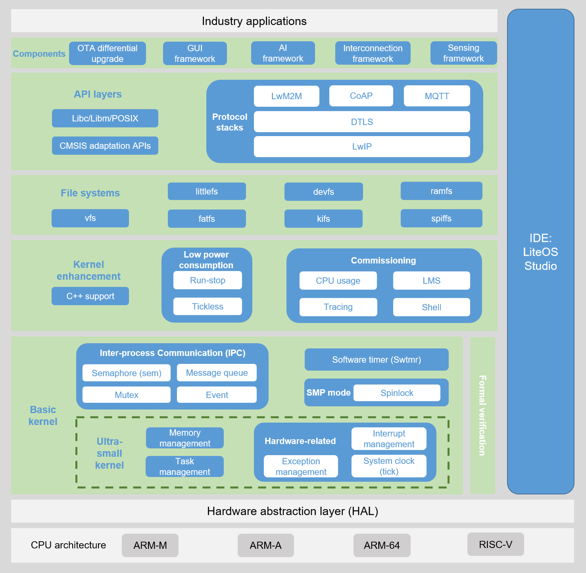

# Architecture

**Figure  1**  Huawei LiteOS architecture  

Huawei LiteOS supports multiple chip architectures, such as Cortex-M series, Cortex-R series, and Cortex-A series, which can be quickly migrated to multiple hardware platforms. Huawei LiteOS supports the uni-processor \(UP\) and symmetric multiprocessor \(SMP\) modes. That is, Huawei LiteOS can run environments with one or multiple processors.

In addition to the basic kernel, Huawei LiteOS contains various components to help users quickly build application scenarios and instances related to IoT. The components are as follows:

-   Basic kernel: includes an untailorable ultra-small kernel and some tailorable modules. The ultra-small kernel covers task management, memory management, interrupt management, error handling, and system clock. Tailorable modules include semaphore, mutex lock, queue management, event management, and software timer.
-   Kernel enhancement: provides enhancement functions based on basic kernel functions, including C++ support and commissioning components. The commissioning component provides powerful fault locating and commissioning capabilities, including shell commands, event tracing, CPU usage, and lite memory sanitizer \(LMS\).
-   File system: provides a set of lightweight file system interfaces to support basic functions of the file system, including vfs, ramfs, and fatfs.
-   System library interface: indicates a series of system library interfaces provided to improve the OS portability and compatibility, including libc, libm, POSIX, and CMSIS adaptation-layer interfaces.
-   Network protocol stack: indicates various network protocol stacks provided to support multiple network functions, including CoAP, LwM2M, and MQTT.
-   Service component: indicates a series of service components or frameworks built based on the preceding components to support more user scenarios such as OTA, GUI, AI, and sensing framework.
-   Huawei LiteOS Studio: indicates an IDE tool customized and developed based on LiteOS. It provides GUI-based code editing, build, burning, and commissioning functions.

