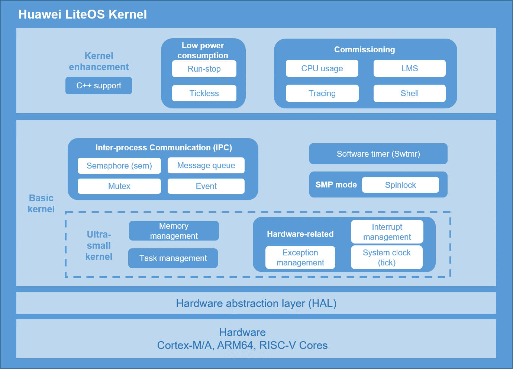

# Kernel Architecture

**Figure  1**  Huawei LiteOS Kernel Architecture  

The basic kernel of Huawei LiteOS includes an untailorable ultra-small kernel and some tailorable modules. The ultra-small kernel covers task management, memory management, interrupt management, error handling, and system clock. Tailorable modules include semaphore, mutex lock, queue management, event management, and software timer. Huawei LiteOS supports the uni-processor \(UP\) and symmetric multiprocessor \(SMP\) modes. That is, Huawei LiteOS can run environments with one or multiple processors.

