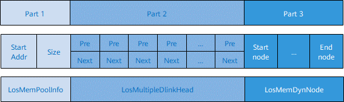
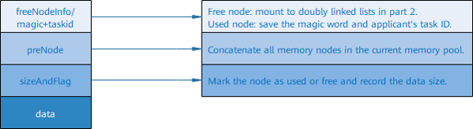
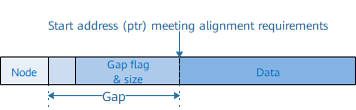
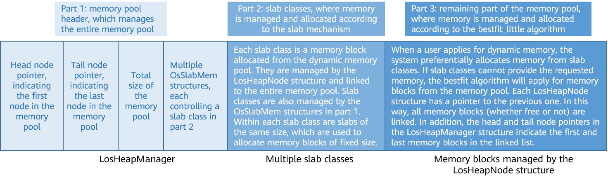
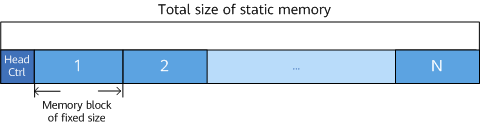

# Overview<a name="EN-US_TOPIC_0311018386"></a>

## Basic Concepts<a name="en-us_topic_0175230252_section51406764161031"></a>

Memory management, one of the core modules of the OS, manages the memory resources of the system. Memory management primarily involves initializing, allocating, and freeing up memory.

While the operating system is running, the memory management module manages memory usage of users and the operating system by allocating and freeing up memory. This helps reduce memory fragments as much as possible.

In Huawei LiteOS, memory management is divided into static and dynamic memory management, and provides functions such as memory initialization, allocation, and free-up.

-   Dynamic memory: a memory block of user-defined size
    -   Advantage: on-demand memory allocation
    -   Disadvantage: risk of memory fragments

-   Static memory: a memory block whose size is predefined at the time of initialization
    -   Advantages: no memory fragments; efficient memory allocation and freeing
    -   Disadvantage: memory cannot be allocated on demand


## Dynamic Memory Operation Mechanism<a name="en-us_topic_0175230252_section43999511154422"></a>

When memory resources are sufficient, memory blocks of any size are allocated from a large contiguous memory \(memory pool or heap memory\) configured in the system based on user requirements. When users do not need a memory block, the memory block can be released back to the system for next use.

Comparing with static memory, the advantage of dynamic memory is on-demand allocation and its disadvantage is fragmentation.

LiteOS supports two dynamic memory management algorithms: bestfit \(also called dlink\) and bestfit\_little.

1.  **bestfit**

    The following figure shows the structure of bestfit.

    **Figure  1**  Structure of bestfit<a name="en-us_topic_0175230252_fig65001513154539"></a>  
    

    -   Part 1

        Indicates the start address and size of the heap memory \(memory pool\).

    -   Part 2

        Part two is an array of which each element is a doubly linked list. Control headers of all free nodes are categorized and mounted to the doubly linked lists in this array.

        If the smallest node allowed by the memory is 2<sup>min </sup>bytes, the first doubly linked list in the array stores free nodes of the size that is bigger than 2<sup>min </sup>and smaller than 2<sup>min+1</sup>. The second doubly linked list in the array stores free nodes of the size that is bigger than 2<sup>min+1 </sup>and smaller than 2<sup>min+2</sup>. The nth doubly linked list in the array stores free nodes of the size that is bigger than 2<sup>min+n–1 </sup>and smaller than 2<sup>min+n</sup>. When memory is allocated, a free node of appropriate size \(the size of the node being created\) is located and memory is allocated to the free node. When memory is freed up, the freed memory is stored to the array as free nodes for later use.

    -   Part 3

        Part 3 uses most space in the memory pool and is the actual area that stores nodes. The LosMemDynNode structure is described as follows:

        ```c
        typedef struct {
            union {
                LOS_DL_LIST freeNodeInfo;         /* Free memory node */
                struct {
                    UINT32 magic;
                    UINT32 taskId   : 16;
                };
            };
            struct tagLosMemDynNode *preNode;
            UINT32 sizeAndFlag;
        } LosMemCtlNode;
        
        typedef struct tagLosMemDynNode {
            LosMemCtlNode selfNode;
        } LosMemDynNode;
        ```

        **Figure  2**  LosMemDynNode structure<a name="en-us_topic_0175230252_fig5721062515475"></a>  
        

        **Figure  3**  Memory application in alignment mode<a name="en-us_topic_0175230252_fig787862301116"></a>  
        

        If the start address of the data space contained in the applied node does not meet alignment requirements, increase the gap to ensure that the returned pointer meets alignment requirements.

2.  **bestfit\_little**

    The bestfit\_little algorithm is the result of integrating the slab mechanism into the bestfit algorithm. The bestfit algorithm is used to allocate the smallest but most appropriate memory block in the memory pool each time. The slab mechanism is used to allocate memory blocks of fixed size to reduce the possibility of fragmentation.

    For the slab mechanism in Huawei LiteOS, users can configure the number of slab classes and the maximum space of each class.

    Assume that there are four slab classes in the memory pool and the maximum space of each class is 512 bytes. These slab classes are allocated by the bestfit algorithm from the memory pool. The first slab class is divided into thirty-two 16-byte slabs, the second sixteen 32-byte slabs, the third eight 64-byte slabs, and the fourth four 128-byte slabs.

    During initialization, the memory pool is initialized first. Then the bestfit algorithm applies for four slab classes from the initialized memory pool, and the slab mechanism initializes the four classes one by one.

    During memory application, memory is allocated from the slab class of the most appropriate size. For example, if a user applies for 20-byte memory, the entire 32-byte slab will be allocated to the user. When the user no longer needs the memory, the entire slab will be reclaimed. However, if no memory block is available in that slab class, instead of applying for memory blocks from bigger slab classes, the bestfit algorithm will apply for memory blocks from the memory pool. During memory release, the system first checks whether the released memory block belongs to any slab classes. If yes, it returns the memory block to the original slab class. If no, it returns the memory block to the original memory pool.

    


## Static Memory Operation Mechanism<a name="en-us_topic_0175230252_section61862829154619"></a>

Static memory is in essence a static array. The size of a static memory block is defined at the time of initialization and cannot be changed since then.

A static memory pool consists of a control block and several memory blocks of same size. The control block is placed at the head of the static memory pool to manage memory blocks. The allocation and free up of memory block according to the size of the blocks.

**Figure  4**  Static memory<a name="en-us_topic_0175230252_fig7616325154619"></a>  


