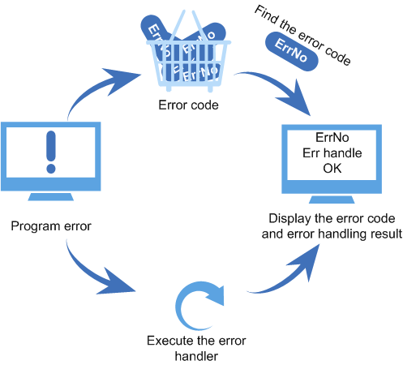

# Overview

## Basic Concepts

When an error occurs during the program running, the API function of the error handling module is called to report the error information, and the registered hook function is called to perform specific processing. The field is saved for locating the problem.

With error handling, illegal inputs in the program can be controlled and prompted to prevent the program from breaking down.

## Operation Mechanism

Error handling is a mechanism used to handle exceptions. When an error occurs in the program, the corresponding error code is displayed. In addition, if the corresponding error handling function is registered, this function is executed.

**Figure  1**  Error handling  

