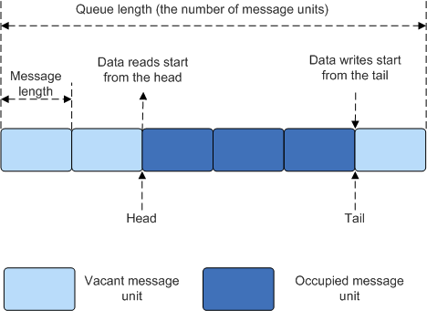

# Overview<a name="EN-US_TOPIC_0311018408"></a>

## Basic Concepts<a name="en-us_topic_0175230224_section6310708215125"></a>

A queue, also called a message queue, is a data structure used for communication between tasks. The queue receives messages of unfixed length from tasks or interrupts, and determines whether to store the transferred messages in the queue space based on different APIs.

Tasks can read messages from a queue. When the queue has no messages, the tasks are suspended. When a new message arrives in the queue, the suspended tasks are woken up and process the new message. Tasks can also write messages to the queue. When the queue is full, the tasks are suspended. When there is an idle message node in the queue, the suspended write tasks are woken up and write a message. If the timeout intervals of the read queue and write queue are set to  **0**, the tasks are not suspended and the APIs directly return messages. This is the non-block mode.

Message queue provides an asynchronous processing mechanism that allows a message to be put into a queue, but not processed immediately. In addition, the queue can buffer messages.

Huawei LiteOS uses queues to implement asynchronous task communication. It has the following features:

-   Messages are queued in first-in-first-out \(FIFO\) mode and can be read and written asynchronously.
-   Both the read queue and write queue support the timeout mechanism.
-   Each time a message is read, the message node becomes idle.
-   The types of messages to be sent are determined by both communication parties. Messages of different lengths \(not exceeding the message node size of the queue\) are allowed.
-   A task can receive messages from and send messages to any message queue.
-   Multiple tasks can receive messages from and send messages to the same message queue.
-   The queue space required for creating a queue is dynamically allocated by the system by default or is allocated by the user and transferred to the API.

## Operation Mechanism<a name="en-us_topic_0175230224_section4442771013118"></a>

**Queue Control Block**

```c
typedef enum {
    OS_QUEUE_READ =0,
    OS_QUEUE_WRITE =1,
    OS_QUEUE_N_RW =2
} QueueReadWrite;

/**
  * Queue information block structure
  */
typedef struct 
{
    UINT8       *queueHandle;                    /* Queue pointer. */
    UINT8       queueState;                      /* Queue status. */
    UINT8       queueMemType;                    /* Create a queue in memory allocation mode. */
    UINT16      queueLen;                        /* Number of message nodes in the queue, that is, the queue length. */
    UINT16      queueSize;                       /* Size of a message node. */
    UINT32      queueID;                         /* Queue ID. */
    UINT16      queueHead;                       /* Position of the message head node (array subscript). */
    UINT16      queueTail;                       /* Position of the message tail node (array subscript). */
    UINT16      readWriteableCnt[OS_QUEUE_N_RW]; /* Array subscript of the number of readable or writable messages in the queue. 0: Number of readable messages.
                                                    1: Number of writable messages. */
    LOS_DL_LIST readWriteList[OS_QUEUE_N_RW];    /* Task waiting list of read or write messages. 
                                                    Subscript 0: Task waiting list of read messages; Subscript 1: Task waiting list of write messages. */
    LOS_DL_LIST memList;                         /* Memory block linked list used by the MailBox module in the CMSIS-RTOS. */
} LosQueueCB;
```

Each queue control block contains the queue status, indicating the usage of the queue.

-   **OS\_QUEUE\_UNUSED**: The queue is not used.
-   **OS\_QUEUE\_INUSED**: The queue is in use.

Each queue control block contains the memory allocation mode during queue creation.

-   **OS\_QUEUE\_ALLOC\_DYNAMIC**: The queue space required for creating a queue is dynamically allocated by the system.
-   **OS\_QUEUE\_ALLOC\_STATIC**: The queue space required for creating a queue is applied by the API caller and transferred to the API.

**Queue Working Principles**

The queue ID is returned if the queue is created successfully.

In the queue control block, a message head node position Head and a message tail node position Tail are maintained to indicate a storage status of a message in a current queue. Head indicates the start position of an occupied message node in the queue. Tail indicates the end position of the occupied message node and the start position of an idle message node. When a queue is created, Head and Tail point to the start position of the queue.

When data is to be written to a queue,  **readWriteableCnt\[1\]**  is used to determine whether data can be written to the queue. Data cannot be written to a full queue \(that is,  **readWriteableCnt\[1\]**  is  **0**\). The write queue supports two write modes: writing to the tail node of the queue and writing to the head node of the queue. When data is written to the tail node, find the start idle message node based on the Tail as the data writing object. If the Tail has pointed to the tail of the queue, the rewind mode is used. When the head node is written, the previous node of the Head functions as the data writing object. If the Head points to the start position of the queue, rewinding starts.

When a queue is read,  **readWriteableCnt\[0\]**  is used to determine whether messages in the queue need to be read. If all idle queues \(that is,  **readWriteableCnt\[0\]**  is** 0**\) are read, the tasks are suspended. If the queue can read messages, read the message on the message node that is first written to the queue, which is found based on the Head. If the Head points to the tail of the queue, rewinding starts.

To delete a queue, find the queue based on the queue ID, set the queue status to unused, and set the queue control block to the initial state. If the queue created using the memory is dynamically allocated by the system is deleted, the memory occupied by the queue is released.

**Figure  1**  Reading and writing data in a queue<a name="en-us_topic_0175230224_fig1396012213119"></a>  


The preceding figure shows the read and write queues. Only the mode of writing data to the tail node is shown in the figure. The mode of writing data to the head node is similar.

