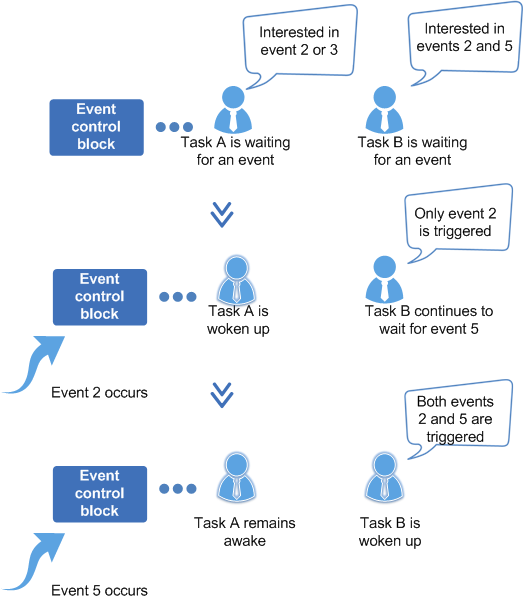

# Overview<a name="EN-US_TOPIC_0311018410"></a>

## Basic Concepts<a name="en-us_topic_0175230222_section3529299142920"></a>

An event is a mechanism for communication between tasks. It can be used to synchronize tasks.

In multi-task environment, synchronization is required between tasks. A waiting task is a synchronization task. Events can be synchronized in one-to-many or many-to-many mode.

-   In a multi-task environment, tasks must be synchronized. In the one-to-many synchronization mode, a task waits for multiple events. In the many-to-many synchronization mode, multiple tasks wait for multiple events.
-   Tasks trigger or wait for events through event control blocks.

Characteristics of events in Huawei LiteOS are as follows:

-   A task can trigger and wait for an event by creating an event control block.
-   Events are not associated with tasks and are independent from each other. A 32-bit unsigned integer variable is used to indicate the type of the event in which a task is triggered. Each bit indicates one event type. Bit 25 is unavailable. Therefore, a maximum of 31 event types are supported.
-   Events are used only for task synchronization, and not for data transmission.
-   Writing the same event type to the event control book for multiple times is equivalent to writing for only once before clearing.
-   Multiple tasks are allowed to read or write the same event.
-   Huawei LiteOS supports event reading and writing timeout.

**Event control block**

```c
/**
 * Event control structure
 */
typedef struct tagEvent {

    UINT32 uwEventID;            /**bit that indicates an event type*/
    LOS_DL_LIST    stEventList;  /**linked list of event reading tasks*/
} EVENT_CB_S, *PEVENT_CB_S;
```

uwEventID indicates the type of the event in which a task is triggered. Each bit indicates one event type with 0 indicating that the event does not occur and 1 indicating that the event occurs. There are 31 bits that indicate event types \(bit 25 is reserved\).

**Event reading mode**

An event reading mode can be configured during event reading. Event reading modes are as follows:

-   All events \(LOS\_WAITMODE\_AND\): indicate that events of all event types specified by a mask need to be read. Event reading succeeds only when all events that are read occur. Otherwise, the task is blocked and waits, or an error code is returned.
-   Any event \(LOS\_WAITMODE\_OR\): indicates that an event of an event type specified by a mask needs to be read. Event reading succeeds when the event that is read occurs. Otherwise, the task is blocked and waits, or an error code is returned.
-   Clear event \(LOS\_WAITMODE\_CLR\): indicates an additional read mode that needs to be used with all events mode or any event mode \(LOS\_WAITMODE\_AND | LOS\_WAITMODE\_CLR or LOS\_WAITMODE\_OR | LOS\_WAITMODE\_CLR\). In this mode, after all events mode or any event mode that has been set is successfully read, the corresponding event type bit in the electronic code book is automatically cleared.

## Operation Mechanism<a name="en-us_topic_0175230222_section6083898817632"></a>

When the LOS\_EventRead API is called to read an event, task can read one or more event types based on the input parameter  **eventMask**. After the event is read successfully, if LOS\_WAITMODE\_CLR is set, the read event type is cleared. Otherwise, the read event type is not cleared and needs to be cleared explicitly. You can select a read mode \(reading all events or reading any event in the event mask type\) based on the input parameter.

When the LOS\_EventWrite API is called to write an event, a specified event type is written into a specified electronic code book. Multiple event types can be written at a time. Event writing may trigger task scheduling.

When the LOS\_EventClear API is called to clear an event, the corresponding bit of the event is cleared based on the input parameter event type and the type of the event to be cleared.

**Figure  1**  Tasks woken up by events<a name="en-us_topic_0175230222_fig5480864217647"></a>  


