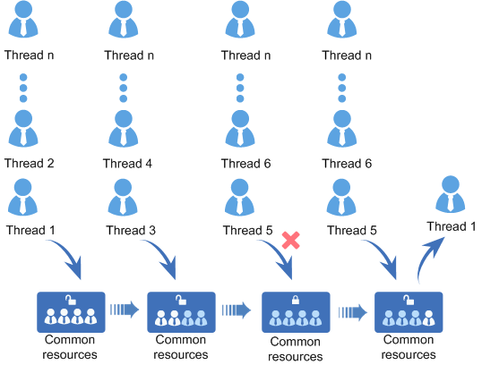

# Overview<a name="EN-US_TOPIC_0311018415"></a>

## Basic Concepts<a name="en-us_topic_0175230383_section6092055115413"></a>

A semaphore is a mechanism used for inter-task communication, to achieve synchronization or mutual exclusion \(mutex\) of access to shared resources between tasks.

Typically, the counter value of a semaphore corresponds to the number of valid resources, indicating the number of remaining shared resources that can be occupied. There are two types of counter values:

-   0: It means a semaphore that cannot be obtained. Therefore, tasks waiting for the semaphore may exist.
-   Positive number: It means a semaphore that can be obtained.

A semaphore for synchronization is different from that for mutex in usage:

-   When semaphores are used for mutex, the initial semaphore counter value is not 0, indicating the number of available shared resources. For using a shared resource, you need to obtain the semaphore, use the shared resource, and then release the semaphore after using it. In this way, when all shared resources are obtained, that is, the semaphore counter value is reduced to 0, other tasks that need to obtain semaphores are blocked, thereby ensuring exclusive access to the shared resources. In addition, when the number of shared resources is 1, you are advised to use a binary semaphore, which is similar to the mutex mechanism.
-   If semaphores are used for synchronization, the initial semaphore counter value is 0. When task1 attempts to get the semaphore, it is blocked because the counter value has reached the maximum. Task1 will enter Ready or Running state after task2 releases the semaphore, thereby achieving task synchronization.

## Operation Mechanism<a name="en-us_topic_0175230383_section63875252163942"></a>

**Semaphore control block**

```c
/**
 * Semaphore control structure.
 */
typedef struct {
    UINT8           semStat;          /**whether to use flag bit*/
    UINT8           semType;          /*semaphore type*/
    UINT16          semCount;         /**semaphore count*/
    UINT32          semID;            /**semaphore quantity index*/
    LOS_DL_LIST     semList;          /*suspend the task blocked on the semaphore*/
} LosSemCB;
```

**Semaphore operation principle**

During semaphore initialization, memory is allocated to  _N_  semaphores \(_N_  is configurable and can be implemented using the LOSCFG\_BASE\_IPC\_SEM\_LIMIT macro.\) All semaphores are initialized and added to the linked list of semaphores that are not in use.

During semaphore creation, a semaphore is obtained from the linked list of semaphores that are not in use and the initial value of the semaphore is set.

During semaphore request, if the counter value of a semaphore is greater than 0, the counter value is decreased by 1 and then returned. Otherwise, tasks are blocked from getting the semaphore and wait for other tasks to post the semaphore. The timeout interval of waiting on the semaphore can be configured. If a task is blocked from getting the semaphore, suspend the task to the tail of the queue of tasks waiting on the semaphore.

If no tasks are waiting on a semaphore, the counter value is increased by 1 and the semaphore is posted. Otherwise, wake up the first task in the queue of tasks waiting on the semaphore.

During semaphore deletion, the semaphore that is in use is set to be not in use and is added to the linked list of semaphores that are not in use.

A semaphore allows multiple tasks to access the same resource at the same time but sets a limit on the number of the tasks. When the number of tasks accessing the same resource reaches the maximum, other tasks that attempt to obtain the resource are blocked until the semaphore is released.

**Figure  1**  Working principle of semaphore<a name="en-us_topic_0175230383_fig5558667216401"></a>  


