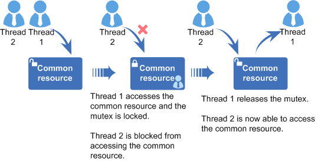

# Overview

## Basic Concepts

A mutual exclusion \(mutex\) is a special binary semaphore designed to grant a task exclusive use of common resources. In addition, the mutex can resolve the priority inversion problem of semaphores.

At a given point in time, a mutex is either locked or unlocked. When a task holds a mutex, the mutex is locked and the task has exclusive ownership of the mutex. When the task releases the mutex, the mutex is unlocked and the task loses exclusive ownership of the mutex. While a task has exclusive ownership of a mutex, other tasks are unable to acquire or release the mutex.

The mutex provided by Huawei LiteOS has the following features:

-   Solve the priority inversion problem using the priority inheritance algorithm.
-   In the scenario where multiple tasks are blocked and wait for the same lock, the task priority-based waiting mode and FIFO mode are supported.

## Operation Mechanism

In a multi-task environment, multiple tasks may battle for the same common resource. If a common resource is not shareable, it must be used exclusively by a particular task. How does the mutex work to avoid the conflict?

When a task accesses a non-shareable common resource, the mutex is locked. Other tasks are blocked from accessing the resource until the task releases the mutex. In this way, only one task accesses the non-shareable common resource at a given point in time, which ensures the integrity of the non-shareable common resources.

**Figure  1**  Working principle of a mutex  

