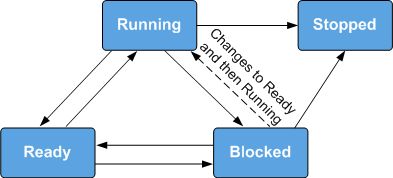

# Overview

## Basic Concepts

From the perspective of the operating system, tasks are the minimum running unit that competes for system resources. Tasks can use or wait for system resources such as CPU and memory, and run independently.

The task module in Huawei LiteOS provides multiple tasks for users. Users can switch among these tasks to manage different business processes. The task module in Huawei LiteOS has the following features:

-   Multiple tasks are supported.
-   Each task represents a thread.
-   The preemptive scheduling mechanism is adopted for tasks with different priorities. Specifically, high-priority tasks can interrupt low-priority tasks, and low-priority task are scheduled only high-priority tasks are blocked or completed.
-   Tasks with the same priority are scheduled in a round-robin way using time slices.
-   A total of 32 priorities are defined, with priority 0 being the highest and 31 being the lowest.

## Related Concepts

**Task States**

A task in Huawei LiteOS switches between different states. After the operating system is initialized, a created task is allowed to contend for system resources according to the scheduling procedure regulated by Huawei LiteOS Kernel.

There are usually four task states:

-   Ready: The task is waiting for execution by a CPU.
-   Running: The task is being executed.
-   Blocked: The task is not on the list of ready tasks. For example, the task may be suspended, delayed, waiting for a semaphore, waiting to read from a queue, or reading from or writing into a queue.
-   Dead: The task execution is complete, and resources are waiting to be reclaimed.

**Task State Transition**

**Figure  1**  Task state schematic diagram  

The state transition process is as follows:

-   Ready → Running

    A task enters Ready state once created. When a task switch occurs, the task with the highest priority is selected from ready tasks and enters Running state to be executed. Although the task is in Running state, it remains on the list of ready tasks.

-   Running → Blocked

    When a running task is blocked \(suspended, delayed, or semaphore reading\), it will be deleted from the Ready list and enter the Blocked state. Thent the task with the highest priority in the Ready list will be executed.

-   Blocked → Ready \(Blocked → Running\)

    After a blocked task is recovered \(for example, if the task is resumed, the task successfully reads a semaphore, or if the delay period or semaphore read period expires\), the task will be added to the list of ready tasks and enters ready state. If the recovered task takes precedence over the running task, a task switch will occur to send the resumed task into running state.

-   Ready → Blocked

    If a ready task is blocked \(suspended\), it will be deleted from the list of ready tasks no longer participated in task scheduling and enter blocked state.

-   Running → Ready

    When a task is created or resumed with a higher priority than the running task, the created or resumed task enters running state and task scheduling will be occurred. Meanwhile, the original running task enters ready state but it remains on the list of ready tasks.

-   Running → Stopped

    When a task running is stopped, the status of it will change from running to stopped. Stopped status includes normal exit after the task is stopped and Invalid status. For example, while separation property\(LOS\_TASK\_STATUS\_DETACHED\) is not set, the task will present Invalid status, which is stopped.

-   Blocked → Stopped

    If calling the delete API when the task is in blocked status, the task status will change from blocked to stopped.

**Task ID**

You will receive a task ID after successfully creating a task. All task IDs on the operating system are unique. You may suspend, resume, or query a task using its ID.

**Task Priority**

Tasks are executed based on their priority. In the event of a task switch, the task with the highest priority will be selected from ready tasks.

**Task Entrypoint Function**

It refers to the function that will be executed after a new task is scheduled. This function is implemented by users and set in the task creation request.

**Task Stack**

Each task has a separate task stack. The task stack stores information such as local variables, registers, function parameters, and function return addresses.

**Task Context**

All the resources \(such as registers\) used by a running task are collectively known as the task context. After a task is suspended, other running tasks might modify the context of the suspended task. If the original context of the suspended task is not saved, the suspended task uses the modified context once resumed, incurring unpredictable errors.

Therefore, Huawei LiteOS saves the context information of switched-out tasks into its own task stack so that the context information can be resumed along with tasks and the system can start from the interrupted code after the tasks are resumed.

**Task Control Block**

Each task has a task control block \(TCB\). A TCB contains task information such as context stack pointer \(SP\), state, priority, ID, name, and stack size. TCB can reflect running conditions of each task.

**Task Switching**

Task switching may involve obtaining the highest-priority task in the Ready list, saving the context of the switched-out task, and restoring the context of the switched-in task.

## Operation Mechanism

When a user creates a task, the system initializes the task stack and presets the context. In addition, the system places the task entrypoint function in the corresponding position so that the function will be executed when the task enters the Running state for the first time.

