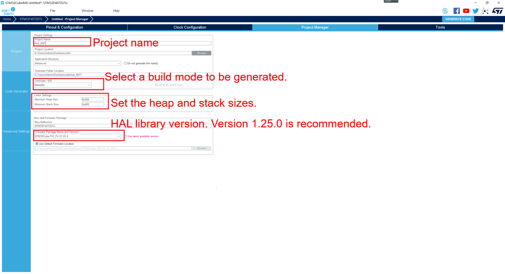
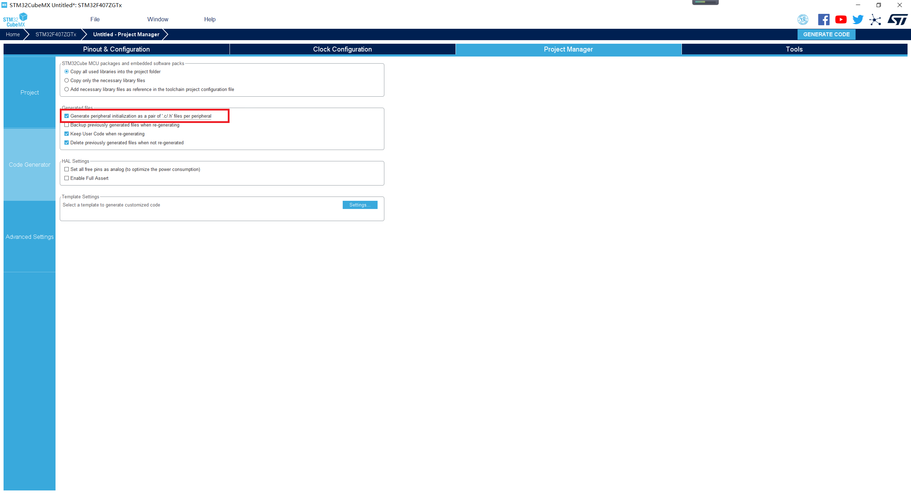

# Configuring a Project

In the project configuration, set the project name, code storage path, build toolchain/IDE, heap and stack sizes, and HAL library version. CubeMX can generate IDE projects such as Makefile, MDK-ARM, and IAR. This guide is based on the GCC build toolchain. Set  **Toolchain/IDE**  to  **Makefile**  accordingly. Switch to the  **Project Manager**  tab page and click  **Project**  on the left, as shown in the following figure.

**Figure  1**  Project configuration  

To facilitate peripheral code maintenance, you are advised to select  **Generate peripheral initialization as a pair of '.c/.h' fles per peripheral**. Click  **Code Generator**  on the left, as shown in the following figure.

**Figure  2**  Code generator configuration  

