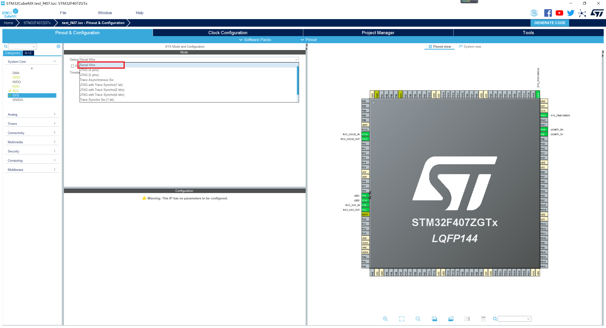

# Configuring Burner Debugging Mode

On the  **Pinout & Configuration**  tab page, select  **SYS**  from the  **System Core** drop-down list box on the left, and set  **Debug**  to  **Serial Wire**, that is, the SWD interface. This interface applies to STLink and JLink.

**Figure  1**  Configure burner debug mode  

