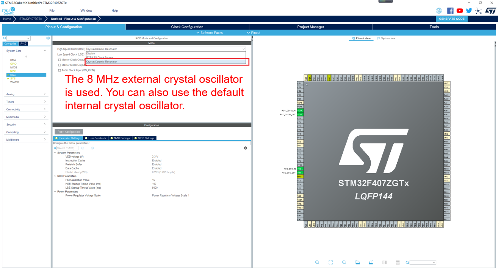
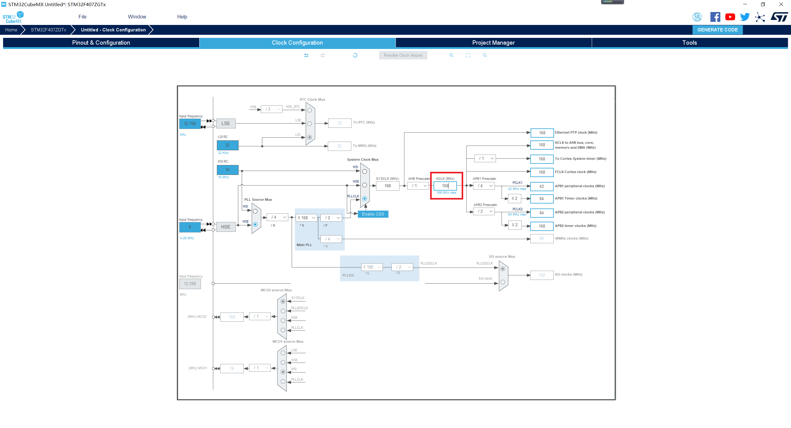

# Configuring Clock

1.  Configure the clock pin.

    Click the  **Pinout & Configuration**  tab, select  **RCC**  from the **System Core**  drop-down list box on the left, and set  **High Speed Clock \(HSE\)**  to  **Crystal/Ceramic Resonator**, that is, the external crystal oscillator is used as the HSE clock source, as shown in the following figure.

    **Figure  1**  Configuring clock pins  
    

2.  Configure the clock frequency.

    Click the  **Clock Configuration**  tab. The highest clock frequency of the STM32F407 chip is 168 MHz. Enter  **168**  in the  **HCLK**  field and press  **Enter**  to complete the configuration, as shown in the following figure. The configuration methods of other development boards are similar.

    **Figure  2**  Configuring clock frequency  
    
