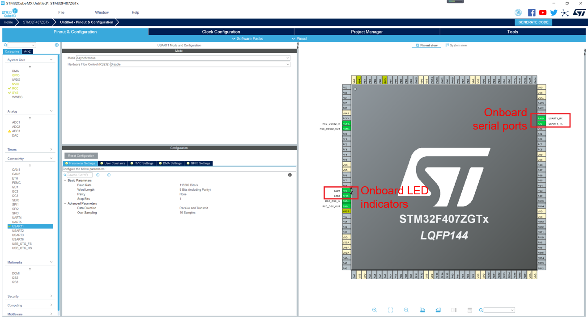

# Configuring Serial Ports and LED Indicator

Click the  **Pinout & Configuration**  tab. The following figure shows how to configure the STM32F407 development board. For other development boards, you can configure them by referring to the schematic diagram of the development board.

**Figure  1**  Configuring serial ports and LED pins  

