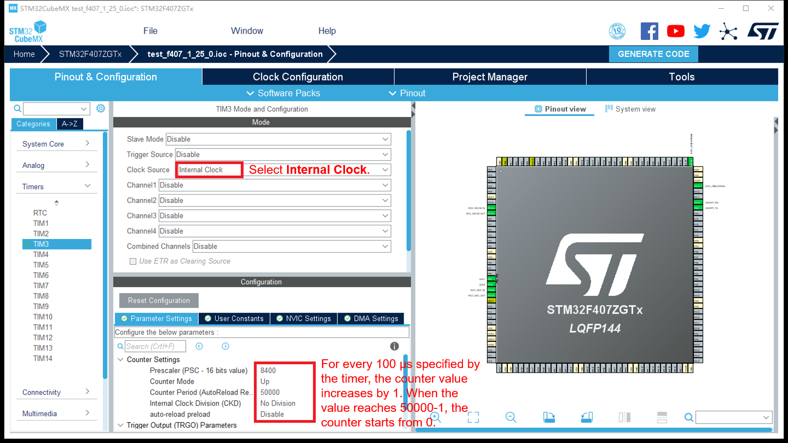

# Configuring Timers

On the  **Pinout & Configuration**  tab page, select  **TIM3**  from the  **Timer**  drop-down list box on the left to facilitate subsequent porting. You can set the parameters as shown in the following figure.

**Figure  1**  Configuring timers  

