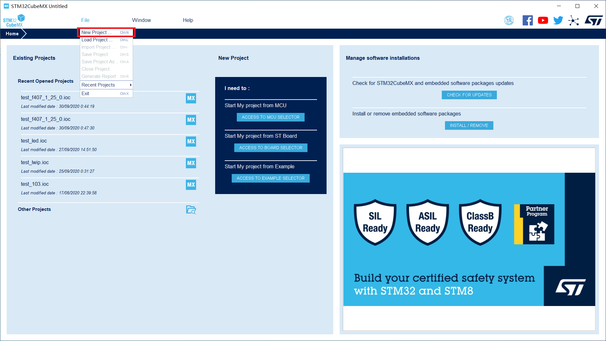
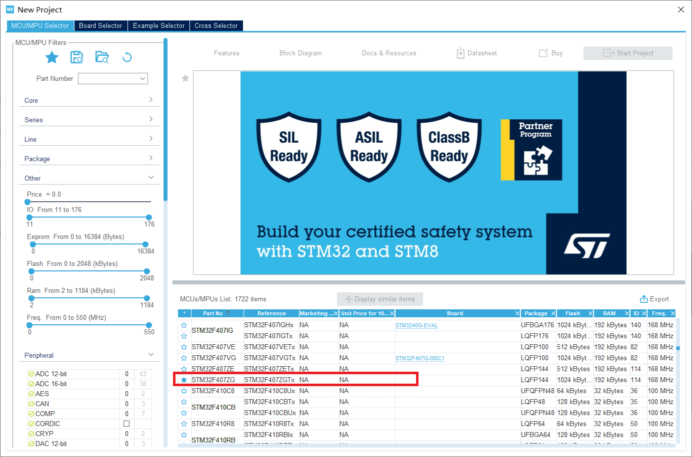

# Creating a Project

1.  Start the STM32CubeMX software, click  **File**  on the menu bar, and select  **New Project**  from the drop-down list, as shown in the following figure.

    **Figure  1**  Creating a project  
    

2.  Select a development board chip.

    Select the corresponding development board MCU \(for the ALIENTEK STM32F407 development board, select  **STM32F407ZG**\), as shown in the following figure.

    **Figure  2**  Setting the development board chip  
    

