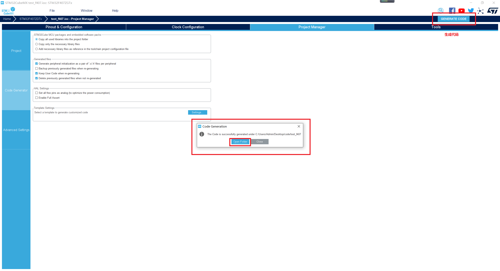

# Generating the Bare Metal Project Code

After the peripheral and project configurations are complete, the bare metal project code is generated, as shown in the following figure.

**Figure  1**  Generate project  

The following table lists the directory structure of the generated bare metal project.

**Table  1**  Directory structure of a bare metal project

<table><thead align="left"><tr id="row6550732141014"><th class="cellrowborder" valign="top" width="23.78%" id="mcps1.2.3.1.1">
Directory or File

</th>
<th class="cellrowborder" valign="top" width="76.22%" id="mcps1.2.3.1.2">
Description

</th>
</tr>
</thead>
<tbody><tr id="row7551103213106"><td class="cellrowborder" valign="top" width="23.78%" headers="mcps1.2.3.1.1 ">
build

</td>
<td class="cellrowborder" valign="top" width="76.22%" headers="mcps1.2.3.1.2 ">
Directory used to store files generated during building

</td>
</tr>
<tr id="row7551632101015"><td class="cellrowborder" valign="top" width="23.78%" headers="mcps1.2.3.1.1 ">
Core

</td>
<td class="cellrowborder" valign="top" width="76.22%" headers="mcps1.2.3.1.2 ">
User code and basic configuration file of the development board

</td>
</tr>
<tr id="row195511328107"><td class="cellrowborder" valign="top" width="23.78%" headers="mcps1.2.3.1.1 ">
Drivers

</td>
<td class="cellrowborder" valign="top" width="76.22%" headers="mcps1.2.3.1.2 ">
Official STM32 HAL library

</td>
</tr>
<tr id="row14551163281018"><td class="cellrowborder" valign="top" width="23.78%" headers="mcps1.2.3.1.1 ">
Makefile

</td>
<td class="cellrowborder" valign="top" width="76.22%" headers="mcps1.2.3.1.2 ">
Makefile of the bare metal project

</td>
</tr>
<tr id="row14551123210105"><td class="cellrowborder" valign="top" width="23.78%" headers="mcps1.2.3.1.1 ">
startup_stm32f407xx.s

</td>
<td class="cellrowborder" valign="top" width="76.22%" headers="mcps1.2.3.1.2 ">
Chip startup file, including the stack definition

</td>
</tr>
<tr id="row117273425108"><td class="cellrowborder" valign="top" width="23.78%" headers="mcps1.2.3.1.1 ">
STM32F407ZGTx_FLASH.ld

</td>
<td class="cellrowborder" valign="top" width="76.22%" headers="mcps1.2.3.1.2 ">
Link script of the bare metal project

</td>
</tr>
</tbody>
</table>

