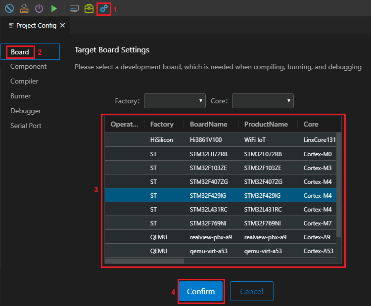
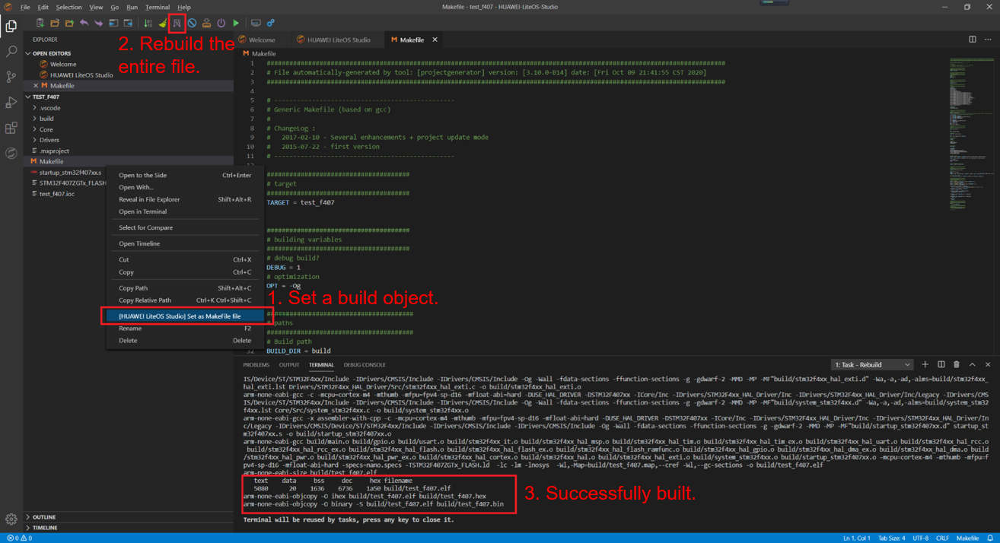
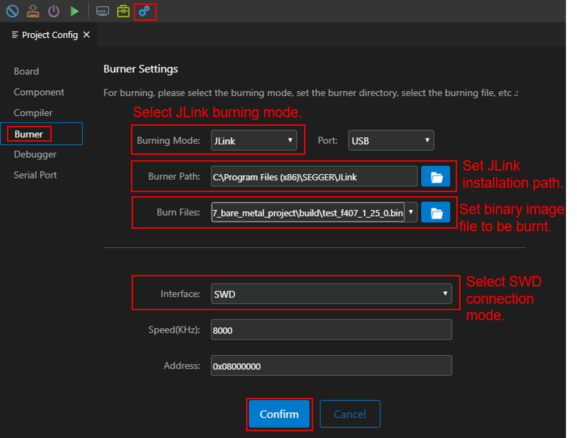
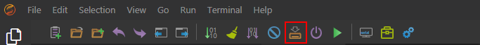
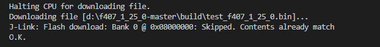
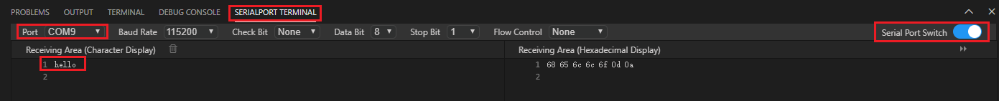

# Using LiteOS Studio to Test a Bare Metal Project

1.  Configure the target board.

    On the  **Project Config**  page, click  **Board**. In the  **Operation**  column, click  **+**. Enter the STM32F407 development board information, select the new development board, and click  **Confirm**, as shown in the following figure.

    

2.  Build the project.

    Right-click  **Makefile**  in the root directory of the bare metal project, choose  **Set as Makefile file**  from the shortcut menu, and build the project. The generated binary image file is stored in the  **build**  directory in the root directory of the project, as shown in the following figure.

    **Figure  1**  Building a bare metal project  
    

3.  Burn the image.
    1.  Configure the burner.

        On the  **Project Config**  tab page, click  **Burner**, as shown in the following figure. The binary image file to be burnt is the .bin file generated in the previous step. Retain the default values of  **Speed\(KHz\)**  and  **Address**.

        

    2.  Click the burn button on the toolbar to start burning.

        

        After the burning is successful, the following information is displayed on  **TERMINAL**:

        

    3.  Check the serial port output.

        Click the    icon on the toolbar to go to the  **SERIALPORT TERMINAL**  page. As shown in the following figure, you only need to set the actual port number for connecting to the development board and enable the serial port. After pressing the  **RESET**  button on the development board, you can see that  **hello**  is continuously output on the  **SERIALPORT TERMINAL**  and the LED indicator of the development board blinks.

        

> **NOTE:** 
>
>For details about how to use LiteOS Studio, see  [STM32 Project Example](https://liteos.gitee.io/liteos_studio/#/project_stm32)  in the LiteOS Studio official document.
