# Huawei LiteOS 快速入门
-   [STM32开发板](#STM32开发板)
    -   [Linux下使用命令行开发](#Linux下使用命令行开发)
        -   [搭建开发环境](#搭建开发环境)
        -   [编译](#编译)
        -   [烧录](#烧录)
        -   [运行](#运行)
    -   [Windows下使用Huawei LiteOS Studio开发](#Windows下使用Huawei-LiteOS-Studio开发)
        -   [搭建开发环境](#搭建开发环境-0)
        -   [编译](#编译-1)
        -   [烧录](#烧录-2)
        -   [运行](#运行-3)
-   [QEMU模拟器运行realview-pbx-a9](#QEMU模拟器realview-pbx-a9)
    -   [简介](#简介)
    -   [Linux下使用命令行开发](#Linux下使用命令行开发-4)
        -   [搭建开发环境](#搭建开发环境-5)
        -   [编译](#编译-6)
        -   [运行](#运行-7)
    -   [Windows下使用Huawei LiteOS Studio开发](#Windows下使用Huawei-LiteOS-Studio开发-8)
        -   [搭建开发环境](#搭建开发环境-9)
        -   [编译](#编译-10)
        -   [运行](#运行-11)
-   [QEMU模拟器运行qemu-virt-a53](#QEMU模拟器qemu-virt-a53)


<h2 id="STM32开发板">STM32开发板</h2>

<h3 id="Linux下使用命令行开发">Linux下使用命令行开发</h3>

<h4 id="搭建开发环境">搭建开发环境</h4>

在Linux上完成编译后，通过Windows访问Linux主机上的文件，完成系统镜像文件的烧录调测与运行。所以开发环境包括Linux下的编译环境，以及Windows下的烧录调测工具和USB转串口驱动。

-   在Linux下搭建编译环境。

    参考[搭建Linux编译环境](./LiteOS_Build_and_IDE.md#4-1)。

-   在Linux下搭建samba服务，实现Windows下对Linux主机上的文件的访问。
    1.  安装samba。

        ```
        sudo apt-get install samba
        ```

    2.  修改samba的配置文件。

        执行以下命令打开samba的配置文件：

        ```
        sudo vi /etc/samba/smb.conf
        ```

        在文件末尾添加以下内容，其中username需要修改为登录Linux主机的用户名，path为Windows下可以直接访问的Linux主机上的共享目录，请根据实际情况设置。

        ```
        [username]
               path = /home/username
               browseable = yes
               available = yes
               public = yes
               writable = yes
               valid users = username
               create mask = 0777
               security = share
               guest ok = yes
               directory mask = 0777
        ```

    3.  重启samba服务。

        ```
        sudo service smbd restart
        ```

    4.  设置samba账户密码。

        执行以下命令设置samba账户密码，按提示输入密码，其中username为登录Linux主机的用户名。

        ```
        sudo smbpasswd -a username
        ```

    5.  设置共享目录权限。

        执行以下命令将第2步中配置的共享目录设置为对任何用户都可读可写可访问，/home/username请修改为第2步中配置的目录。

        ```
        sudo chmod 777 /home/username
        ```

    6.  通过Windows访问Linux主机上的共享目录。

        在Windows资源管理器路径中输入\\\\Linux主机IP，即可访问Linux共享目录。


-   烧录工具为JLink仿真器。

    在Windows主机中，从JLink官网下载<a href="https://www.segger.com/downloads/jlink/JLink_Windows.exe" target="_blank">JLink仿真器</a>。双击下载的JLink应用程序，直接使用默认配置进行安装即可。

-   安装USB转串口驱动。

    以CH340驱动为例，在Windows主机中，从官网下载<a href="http://www.wch.cn/downloads/CH341SER_EXE.html" target="_blank">转串口Windows驱动程序</a>。双击下载的驱动程序，直接使用默认配置进行安装即可。完成驱动安装后，使用USB线连接开发板的USB转串口到Windows主机，可以在Windows设备管理器中查看端口号，如下图所示。

    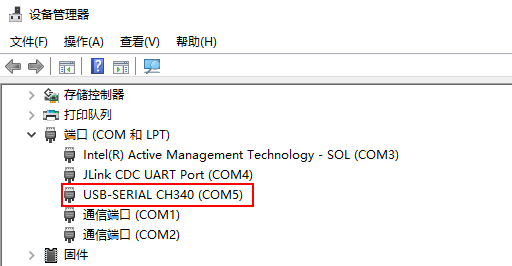


<h4 id="编译">编译</h4>

搭建完开发环境后，即可按以下步骤完成编译。

1.  下载Huawei LiteOS代码。

    请下载完整的Huawei LiteOS代码，代码仓在gitee上，请选择master分支进行下载：<a href="https://gitee.com/LiteOS/LiteOS" target="_blank">LiteOS代码仓</a>。

2.  拷贝开发板配置文件为根目录.config文件。

    根据实际使用的开发板，拷贝tools/build/config/目录下的默认配置文件$\{platform\}.config到根目录，并重命名为.config。

3.  配置想要执行的Demo。

    在Huawei\_LiteOS根目录下执行**make menuconfig**命令，打开menuconfig的图形化配置界面，使能想要执行的Demo。下面以使能“Kernel Task Demo”为例，介绍如何配置Demo。其他Demo的使能方法，详见Huawei LiteOS源码根目录下demos目录中各个子目录中的README\_CN.md。

    进入菜单项“**Demos → Kernel Demo**”，通过空格键选择使能“**Enable Kernel Demo**”（使能后菜单项前面的括号里会有一个星号，即\[ \* \]），进入子菜单“**Kernel Demo Entry**”，选择“**DemoEntry**”（该配置项可以单独执行某个或某几个内核Demo，另一个配置项InspectEntry表示执行所有内核Demo）后，在其子菜单中选择“**Run Kernel Task Demo**”，如下图所示。

    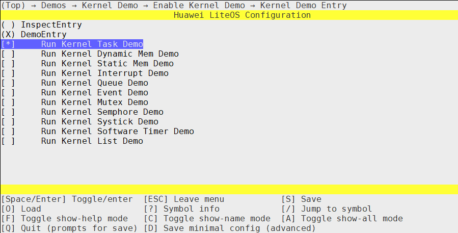

    配置完成后，输入字母“S”保存配置项，其默认会保存到根目录下的.config文件中，回车即可完成保存。最后输入字母“Q”退出menuconfig配置。

4.  清理工程。

    在编译前，先在Huawei\_LiteOS根目录下执行**make clean**命令删除以前编译出的二进制文件。

5.  编译工程。

    在Huawei\_LiteOS根目录下执行**make**命令即可完成工程编译，编译结果会在屏幕上输出。

    编译出的文件保存在out目录中，以Cloud\_STM32F429IGTx\_FIRE为例，生成的系统镜像文件、反汇编等文件在out/Cloud\_STM32F429IGTx\_FIRE目录中，库文件在out/Cloud\_STM32F429IGTx\_FIRE/lib目录中，中间文件在out/Cloud\_STM32F429IGTx\_FIRE/obj目录中。因在步骤 3 中使能了“Kernel Task Demo”，所以在保存库文件的lib目录中会有相应的库文件libkernel\_demo.a。


<h4 id="烧录">烧录</h4>

1.  将JLink仿真器的两端分别连接到开发板和Windows主机上。
2.  使用USB线连接开发板的USB转串口到Windows主机上。
3.  运行JFlashLite.exe。

    双击JLink安装目录中的JFlashLite.exe，如下图所示。

    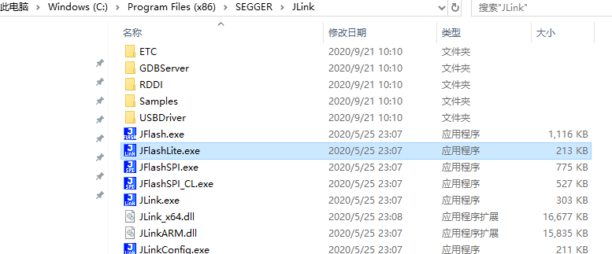

4.  设置开发板信息。

    点击下图红框中的“...”按钮，选择对应的设备，图中以STM32F429为例，将设备设置为STM32F429IG。最后点击右边的“OK”按钮完成设置。

    

5.  选择要烧录的镜像文件。

    点击下图箭头所指的“...”按钮。

    

    在弹出的窗口中选择要烧录的文件，这里可以通过搭建好的samba服务，访问Linux下编译好的二进制文件，在文件路径栏中输入“\\\\IP”即可访问Linux主机的文件，这里需要将IP替换为实际的Linux主机IP。

    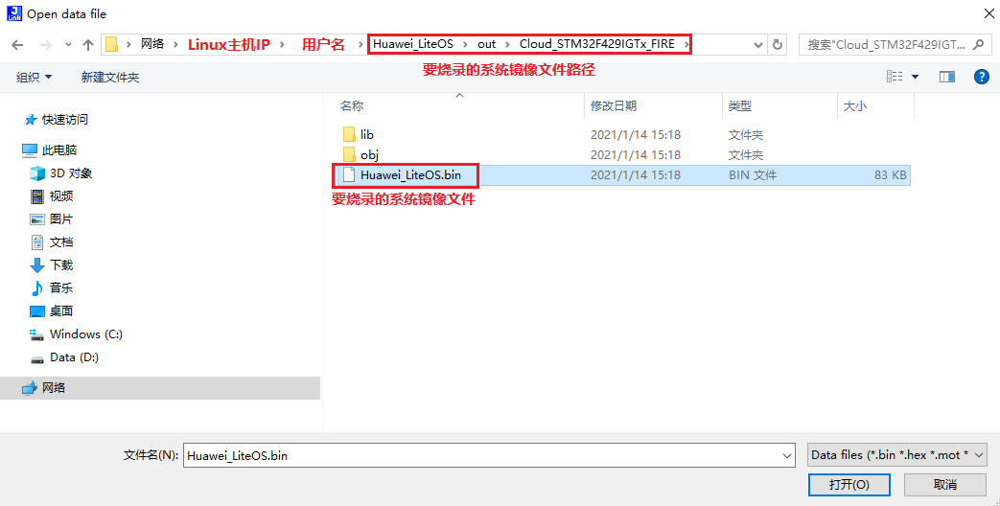

6.  执行烧录。

    点击下图箭头所指的“Program Device”按钮进行烧录。烧录成功后，会在Log框中提示“...Downloading...Done”，如下图所示。

    


<h4 id="运行">运行</h4>

1.  打开任意一款串口工具，将端口号设置为[安装USB转串口驱动](#搭建开发环境)中查询到的端口号，波特率等其他设置可以直接使用如下所示的默认值。

    

2.  复位开发板，运行Huawei LiteOS。

    按下开发板的复位RESET按钮，可以看到串口输出了Huawei LiteOS启动后运行“Kernel Task Demo”的打印信息，其中“Huawei LiteOS \#”是Shell交互界面的提示符，如下图所示：

    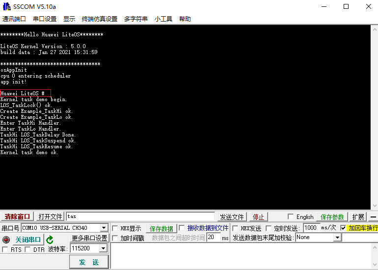

    Huawei LiteOS默认打开了Shell组件，可以在串口工具中输入支持的Shell命令，再勾选“加回车换行”，点击“发送”按钮即可执行Shell命令，如下图所示：

    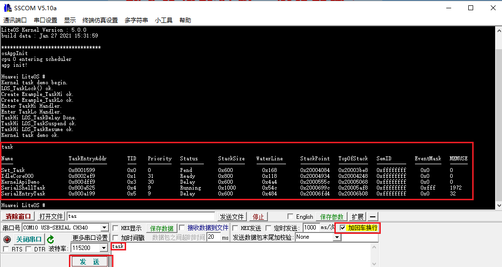

    如果想要更多的了解Shell功能，可以参考官方文档：[Shell使用教程](../shell/README_CN.md)。

    Shell组件是否已经使能，可以通过Linux下make menuconfig命令来确认，如果已经使能，则应该配置了“Enable shell”选项：

    


<h3 id="Windows下使用Huawei-LiteOS-Studio开发">Windows下使用Huawei LiteOS Studio开发</h3>

<h4 id="搭建开发环境-0">搭建开发环境</h4>

1.  下载Huawei LiteOS Studio。

    访问<a href="https://gitee.com/LiteOS/LiteOS_Studio/releases/" target="_blank">Huawei LiteOS Studio下载链接</a>获取最新发行版。

2.  搭建Huawei LiteOS Studio开发环境。

    参考<a href="https://liteos.gitee.io/liteos_studio/#/install" target="_blank">Huawei LiteOS Studio安装指南</a>，完成开发环境的搭建。


<h4 id="编译-1">编译</h4>

1.  新建工程/打开工程。

    如果本地没有下载Huawei LiteOS的源代码，则需要新建工程，参考<a href="https://liteos.gitee.io/liteos_studio/#/project_stm32?id=%e6%96%b0%e5%bb%ba%e5%b7%a5%e7%a8%8b%ef%bc%88%e5%8f%af%e9%80%89%ef%bc%89" target="_blank">Huawei LiteOS Studio新建工程</a>。

    如果本地已经下载Huawei LiteOS的源代码，则可以通过Studio直接打开本地源代码，无需新建工程，参考<a href="https://liteos.gitee.io/liteos_studio/#/project_stm32?id=%e6%89%93%e5%bc%80%e5%b7%a5%e7%a8%8b" target="_blank">Huawei LiteOS Studio打开工程</a>。

2.  配置实际使用的开发板。

    在Studio的“工程配置”**→**“目标板”窗口，列出了Huawei LiteOS当前支持的所有开发板，请根据实际使用的开发板进行选择。

    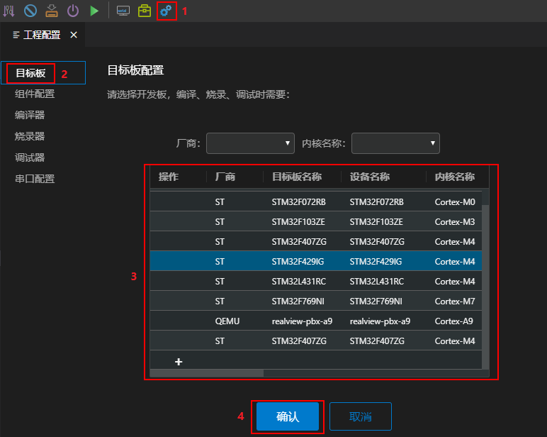

3.  配置想要执行的Demo。

    打开Studio的“工程配置”**→**“组件配置”窗口，在左侧的“选择组件”界面中点击想要使能或修改的组件，在右侧的“组件属性”栏勾选需要使能的组件，最后点击“确认”按钮保存。下面以使能“Kernel Task Demo”为例，介绍如何配置Demo。其他Demo的使能方法，可以参考Huawei LiteOS源码根目录下demos目录中各个子目录中的README\_CN.md。

    在“选择组件”界面中，选择菜单项“**Demos → Kernel Demo**”，然后在右侧的“组件属性”栏勾选“**Enable Kernel Demo**”，在菜单项“**Kernel Demo Entry**”中选择“**DemoEntry**”（该配置项可以单独执行某个或某几个内核Demo，另一个配置项InspectEntry表示执行所有内核Demo）后，在其子菜单中选择“**Run Kernel Task Demo**”，最后点击“确认”按钮保存，如下图所示。

    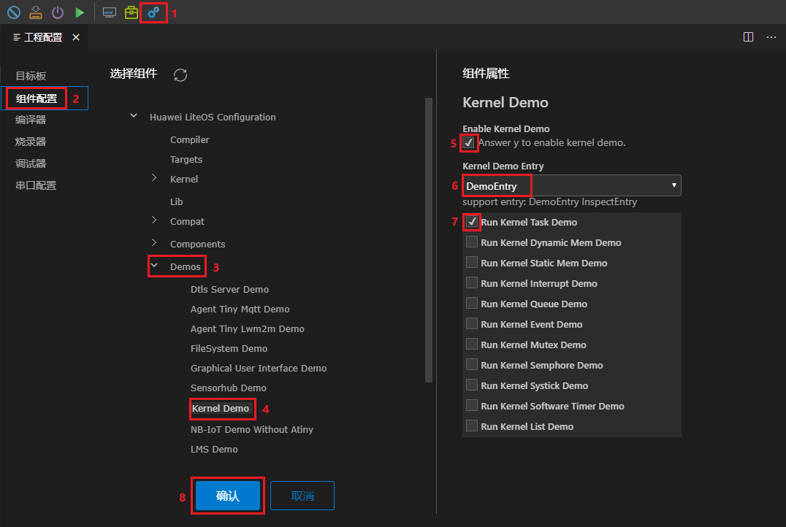

4.  编译工程。

    如何在Studio中配置编译器并编译，可以参考<a href="https://liteos.gitee.io/liteos_studio/#/project_stm32?id=%e7%bc%96%e8%af%91%e9%85%8d%e7%bd%ae-%e7%bc%96%e8%af%91%e4%bb%a3%e7%a0%81" target="_blank">Studio编译配置-编译代码</a>，如果在此之前已经编译过，则可以使用“重新编译”按钮清理以前编译出的二进制文件并重新编译。编译出的文件保存在out目录中，以Cloud\_STM32F429IGTx\_FIRE为例，生成的系统镜像文件、反汇编等文件在out/Cloud\_STM32F429IGTx\_FIRE目录中，库文件在out/Cloud\_STM32F429IGTx\_FIRE/lib目录中，中间文件在out/Cloud\_STM32F429IGTx\_FIRE/obj目录中。因在步骤 3 中使能了“Kernel Task Demo”，所以在保存库文件的lib目录中会有相应的库文件libkernel\_demo.a。


<h4 id="烧录-2">烧录</h4>

使用USB线连接开发板的USB转串口到电脑，并将JLink仿真器正确连接到电脑后，就可以使用JLink将系统镜像文件Huawei\_LiteOS.bin烧录到开发板，烧录器配置以及烧录方法，请参考<a href="https://liteos.gitee.io/liteos_studio/#/project_stm32?id=%e7%83%a7%e5%bd%95%e9%85%8d%e7%bd%ae-%e7%83%a7%e5%bd%95" target="_blank">Studio烧录配置-烧录</a>。

<h4 id="运行-3">运行</h4>

烧录成功后，点击串口终端图标打开串口终端界面，设置端口（请根据实际使用的串口端口号进行设置），开启串口开关，开发板按下复位RESET按钮，可以看到串口输出，接收区输出的内容就是Huawei LiteOS启动后运行“Kernel Task Demo”的输出，如下图所示：

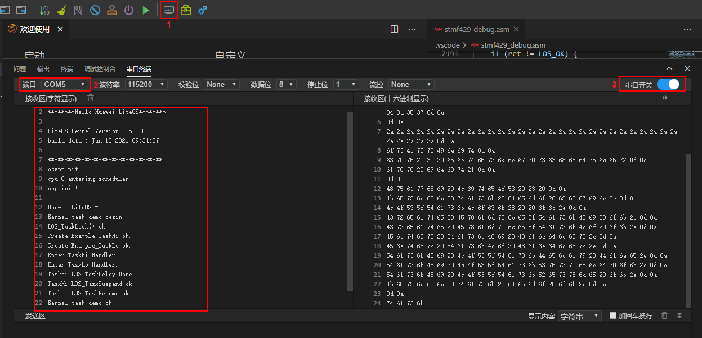

Huawei LiteOS默认打开了Shell组件，可以在串口终端的“发送区”输入支持的Shell命令，再勾选“加回车换行”，点击“发送”按钮即可执行Shell命令。命令的输出结果显示在“接收区”中，最后的“Huawei LiteOS \#”即是Shell交互界面的提示符，如下图所示：

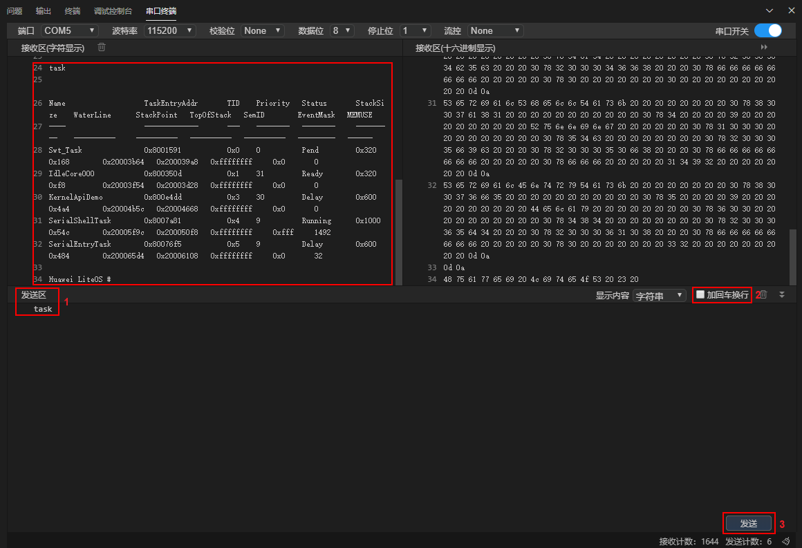

如果想要更多的了解Shell功能，可以参考官方文档：[Shell使用教程](../shell/README_CN.md)。

Shell组件是否已经使能，可以按照下图所示进行确认，如果已经使能，则应该配置了“Enable full functionality of shell”选项：

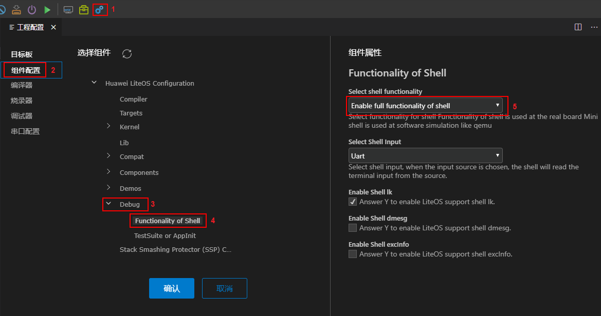

<h2 id="QEMU模拟器realview-pbx-a9">QEMU模拟器运行realview-pbx-a9</h2>

<h3 id="简介">简介</h3>

QEMU是一款通用的开源虚拟化模拟器，通过软件模拟硬件设备，当QEMU直接模拟CPU时，它能够独立运行操作系统，有关QEMU的介绍可参考[https://github.com/qemu/qemu](https://github.com/qemu/qemu)。realview-pbx-a9工程就是使用QEMU模拟Cortex-A9处理器，以运行Huawei LiteOS操作系统。

<h3 id="Linux下使用命令行开发-4">Linux下使用命令行开发</h3>

<h4 id="搭建开发环境-5">搭建开发环境</h4>

realview-pbx-a9工程在Linux下的开发环境包括编译环境和QEMU模拟器。

-   搭建编译环境。

    请参考[搭建Linux编译环境](LiteOS_Build_and_IDE.md#4-1)。

-   安装QEMU模拟器。

    可以参考如下命令安装：

    ```
    $ apt-get install qemu
    $ apt-get install qemu-system
    ```

    除此之外，也可以通过<a href="https://www.qemu.org/download/#source" target="_blank">QEMU源码包</a>编译安装的方式安装QEMU。


<h4 id="编译-6">编译</h4>

1.  下载Huawei LiteOS代码。

    请下载完整的Huawei LiteOS代码，代码仓在gitee上，请选择master分支进行下载：<a href="https://gitee.com/LiteOS/LiteOS" target="_blank">LiteOS代码仓</a>。

2.  拷贝模拟器工程配置文件为根目录.config文件。

    在Huawei\_LiteOS根目录下执行如下命令，拷贝realview-pbx-a9模拟器工程的.config文件：

    ```
    $ cp tools/build/config/realview-pbx-a9.config .config
    ```

3.  配置想要执行的Demo。

    在Huawei\_LiteOS根目录下执行**make menuconfig**命令，打开menuconfig的图形化配置界面，使能想要执行的Demo。下面以使能“Kernel Task Demo”为例，介绍如何配置Demo。其他Demo的使能方法，详见Huawei LiteOS源码根目录下demos目录中各个子目录中的README\_CN.md。

    进入菜单项“**Demos → Kernel Demo**”，通过空格键选择使能“**Enable Kernel Demo**”（使能后菜单项前面的括号里会有一个星号，即\[ \* \]），进入子菜单“**Kernel Demo Entry**”，选择“**DemoEntry**”（该配置项可以单独执行某个或某几个内核Demo，另一个配置项InspectEntry表示执行所有内核Demo）后，在其子菜单中选择“**Run Kernel Task Demo**”，如下图所示。

    

    配置完成后，输入字母“S”保存配置项，其默认会保存到根目录下的.config文件中，回车即可完成保存。最后输入字母“Q”退出menuconfig配置。

4.  清理工程。

    在编译前，先在Huawei\_LiteOS根目录下执行**make clean**命令删除以前编译出的二进制文件。

5.  编译工程。

    在Huawei\_LiteOS根目录下执行**make**命令即可完成工程编译，编译结果会在屏幕上输出。生成的系统镜像文件、反汇编等文件在out/realview-pbx-a9目录中，库文件在out/realview-pbx-a9/lib目录中，中间文件在out/realview-pbx-a9/obj目录中。因在步骤 3 中使能了“Kernel Task Demo”，所以在保存库文件的lib目录中会有相应的库文件libkernel\_demo.a。


<h4 id="运行-7">运行</h4>

可以参考如下命令，通过QEMU启动guest虚拟机运行Huawei LiteOS，因为realview-pbx-a9工程默认使能了SMP（多核），所以启动虚拟机时也需要设置-smp参数：

```
$ qemu-system-arm -machine realview-pbx-a9 -smp 4 -m 512M -kernel out/realview-pbx-a9/Huawei_LiteOS.bin -nographic
```

> **说明：** 
>上述命令各参数含义如下，更多信息可以通过执行qemu-system-arm --help命令查看：
>-   -machine：设置QEMU要仿真的虚拟机类型。
>-   -smp：设置guest虚拟机的CPU的个数。
>-   -m：为此guest虚拟机预留的内存大小，如果不指定，默认为128M。
>-   -kernel：设置要运行的镜像文件（包含文件路径）。
>-   -nographic：以非图形界面启动虚拟机。

虚拟机启动后，就会运行Huawei LiteOS，并进入Shell交互界面（出现“Huawei LiteOS \#”提示符），可以看到如下打印信息：

```
********Hello Huawei LiteOS********

LiteOS Kernel Version : 5.0.0      
Processor  : Cortex-A9 * 4
Run Mode   : SMP
GIC Rev    : GICv1
build time : Jan  5 2021 16:30:06  

********************************** 

main core booting up...
osAppInit
releasing 3 secondary cores
cpu 0 entering scheduler
cpu 2 entering scheduler
cpu 3 entering scheduler
cpu 1 entering scheduler
app init!

Kernel task demo begin.
LOS_TaskLock() ok.

Create Example_TaskHi ok.
Create Example_TaskLo ok.
Enter TaskLo Handler.
Enter TaskHi Handler.
TaskHi LOS_TaskDelay Done.
TaskHi LOS_TaskSuspend ok.
TaskHi LOS_TaskResume ok.
Kernel task demo ok.

Huawei LiteOS #
```

如果想要更多的了解Shell功能，可以参考官方文档：[Shell使用教程](../shell/README_CN.md)。

<h3 id="Windows下使用Huawei-LiteOS-Studio开发-8">Windows下使用Huawei LiteOS Studio开发</h3>

<h4 id="搭建开发环境-9">搭建开发环境</h4>

1.  下载Huawei LiteOS Studio。

    访问<a href="https://gitee.com/LiteOS/LiteOS_Studio/releases/" target="_blank">Huawei LiteOS Studio下载链接</a>获取最新发行版。

2.  搭建Huawei LiteOS Studio开发环境。

    参考<a href="https://liteos.gitee.io/liteos_studio/#/project_stm32?id=%e6%90%ad%e5%bb%bawindows%e5%bc%80%e5%8f%91%e7%8e%af%e5%a2%83" target="_blank">搭建Windows开发环境</a>，完成开发环境的搭建。


<h4 id="编译-10">编译</h4>

1.  新建工程/打开工程。

    如果本地没有下载Huawei LiteOS的源代码，则需要新建工程，参考<a href="https://liteos.gitee.io/liteos_studio/#/project_stm32?id=%e6%96%b0%e5%bb%ba%e5%b7%a5%e7%a8%8b%ef%bc%88%e5%8f%af%e9%80%89%ef%bc%89" target="_blank">Huawei LiteOS Studio新建工程</a>。

    如果本地已经下载Huawei LiteOS的源代码，则可以通过Studio直接打开本地源代码，无需新建工程，参考<a href="https://liteos.gitee.io/liteos_studio/#/project_stm32?id=%e6%89%93%e5%bc%80%e5%b7%a5%e7%a8%8b" target="_blank">Huawei LiteOS Studio打开工程</a>。

2.  配置QEMU模拟的开发板。

    打开Studio的“工程配置”**→**“目标板”窗口，选择“realview-pbx-a9”后点击“确认”按钮保存。

    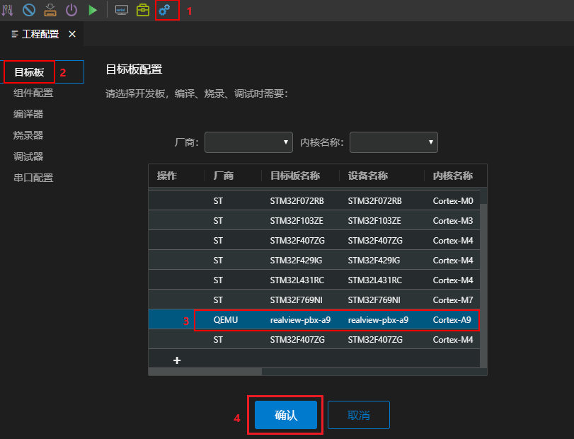

3.  配置想要执行的Demo。

    打开Studio的“工程配置”**→**“组件配置”窗口，在左侧的“选择组件”界面中点击想要使能或修改的组件，在右侧的“组件属性”栏勾选需要使能的组件，最后点击“确认”按钮保存。下面以使能“Kernel Task Demo”为例，介绍如何配置Demo。其他Demo的使能方法，可以参考Huawei LiteOS源码根目录下demos目录中各个子目录中的README\_CN.md。

    在“选择组件”界面中，选择菜单项“**Demos → Kernel Demo**”，然后在右侧的“组件属性”栏勾选“**Enable Kernel Demo**”，在菜单项“**Kernel Demo Entry**”中选择“**DemoEntry**”（该配置项可以单独执行某个或某几个内核Demo，另一个配置项InspectEntry表示执行所有内核Demo）后，在其子菜单中选择“**Run Kernel Task Demo**”，最后点击“确认”按钮保存，如下图所示。

    

4.  编译工程。

    如何在Studio中配置编译器并编译，可以参考<a href="https://liteos.gitee.io/liteos_studio/#/project_stm32?id=%e7%bc%96%e8%af%91%e9%85%8d%e7%bd%ae-%e7%bc%96%e8%af%91%e4%bb%a3%e7%a0%81" target="_blank">Studio编译配置-编译代码</a>，如果在此之前已经编译过，则可以使用“重新编译”按钮清理以前编译出的二进制文件并重新编译。生成的系统镜像文件、反汇编等文件在out/realview-pbx-a9目录中，库文件在out/realview-pbx-a9/lib目录中，中间文件在out/realview-pbx-a9/obj目录中。因在步骤 3 中使能了“Kernel Task Demo”，所以在保存库文件的lib目录中会有相应的库文件libkernel\_demo.a。


<h4 id="运行-11">运行</h4>

Huawei LiteOS Studio通过“烧录”功能启动QEMU虚拟机运行Huawei LiteOS。如何配置“烧录器”并运行Huawei LiteOS，可以参考<a href="https://liteos.gitee.io/liteos_studio/#/project_stm32?id=realview-pbx-a9%e6%89%a7%e8%a1%8cqemu%e4%bb%bf%e7%9c%9f" target="_blank">启动realview-pbx-a9仿真工程</a>。烧录成功后，自动启动Huawei LiteOS，可以在“终端”界面中看到如下输出，回车后既可进入Shell交互界面（出现“Huawei LiteOS \#”提示符）：

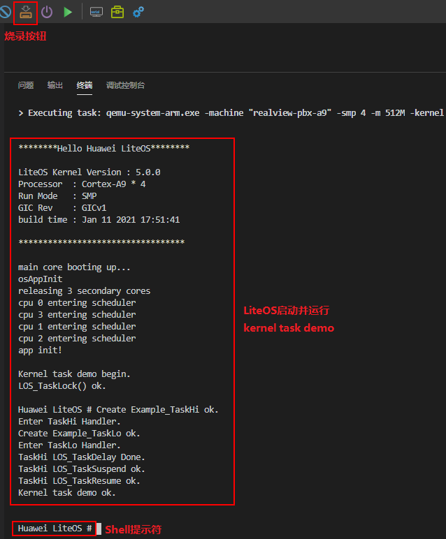

Huawei LiteOS默认打开了Shell组件，可以在终端界面的“Huawei LiteOS \#”提示符后输入支持的Shell命令，执行Shell，如下图所示。如果要重新编译系统，需要先退出Shell交互界面。

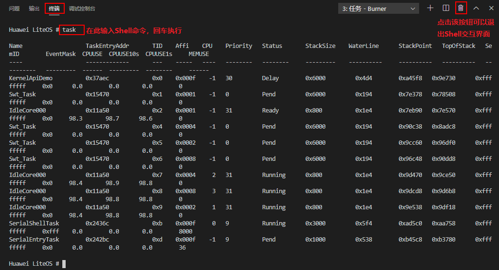

如果想要更多的了解Shell功能，可以参考官方文档：[Shell使用教程](../shell/README_CN.md)。

<h2 id="QEMU模拟器qemu-virt-a53">QEMU模拟器运行qemu-virt-a53</h2>

即将适配支持，敬请期待。