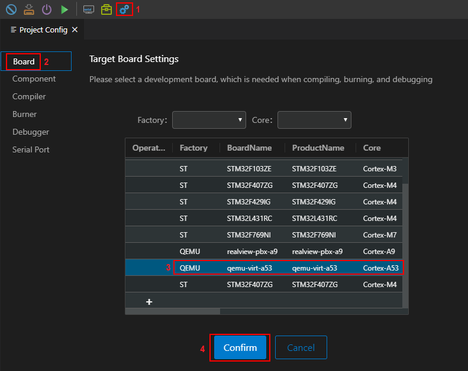
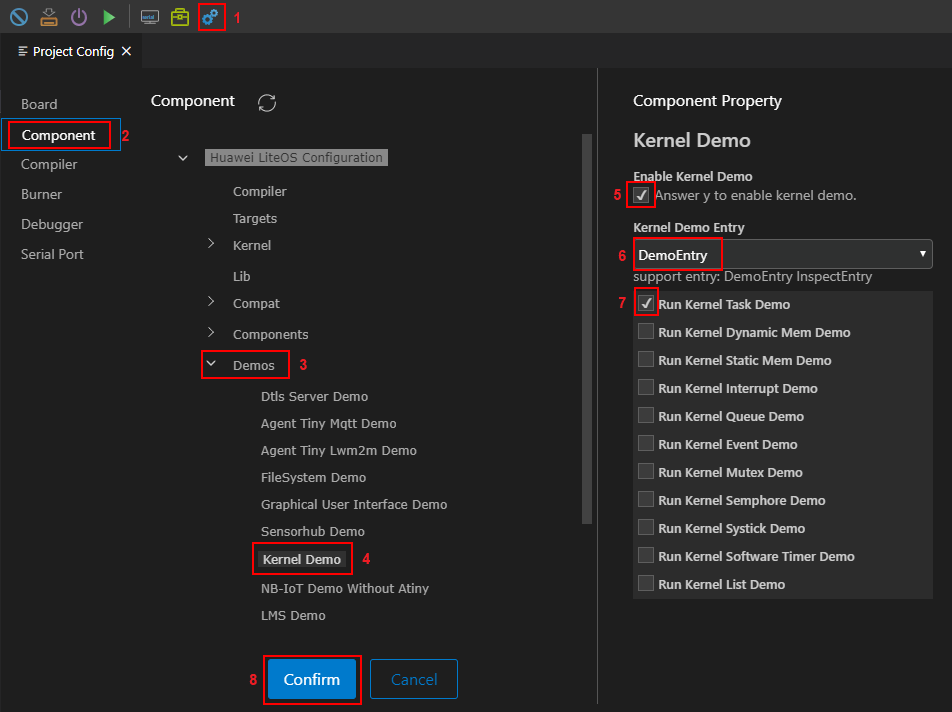

# Build

1.  Create or open a project.

    If the source code of Huawei LiteOS is not downloaded locally, you need to create a project. For details, see  [Creating a Project on Huawei LiteOS Studio](https://liteos.gitee.io/liteos_studio/#/project_stm32?id=%e6%96%b0%e5%bb%ba%e5%b7%a5%e7%a8%8b%ef%bc%88%e5%8f%af%e9%80%89%ef%bc%89).

    If the source code of Huawei LiteOS has been downloaded locally, you can directly open the local source code on Studio without creating a project. For details, see  [Opening a Project on Huawei LiteOS Studio](https://liteos.gitee.io/liteos_studio/#/project_stm32?id=%e6%89%93%e5%bc%80%e5%b7%a5%e7%a8%8b).

2.  Configure the development board emulated by QEMU.

    Choose  **Project Config**  \>  **Board**  on the Studio, select  **qemu-virt-a53**, and click  **Confirm**.

    

3.  Configure the demo to be executed.

    Choose  **Project Config**  \>  **Component**. Click the component to be enabled or modified, select the component to be enabled in the  **Component Property**  area on the right, and click  **Confirm**. The following uses Kernel Task Demo as an example to describe how to configure a demo. For details about how to enable other demos, see README in each subdirectory of the  **demos**  directory in the root directory of the Huawei LiteOS source code.

    In the  **Component**  area on the left, choose  **Demos**  \>  **Kernel Demo**. In the  **Component Property**  area on the right, select  **Answer y to enable kernel demo**  and select  **DemoEntry**  in the  **Kernel Demo Entry**  field. \(This configuration item can be used to execute one or multiple kernel demos. Another configuration item  **InspectEntry**  indicates that all kernel demos are executed.\) Select  **Run Kernel Task Demo**  from the submenu and click  **Confirm**, as shown in the following figure.

    

4.  Build the project.

    For details about how to configure a compiler and perform build on the Studio, see  [Studio Compiler Configuration - Building Code](https://liteos.gitee.io/liteos_studio/#/project_stm32?id=%e7%bc%96%e8%af%91%e9%85%8d%e7%bd%ae-%e7%bc%96%e8%af%91%e4%bb%a3%e7%a0%81). If the code has been built, you can clear the binary files that have been built and rebuild the code. The generated system image files and disassembly files are stored in the  **out/qemu-virt-a53**  directory, and the library files are stored in the  **out/qemu-virt-a53/lib**  directory, the intermediate file is stored in the  **out/qemu-virt-a53/obj**  directory.  **Kernel Task Demo**  is enabled in step 3, and the  **libkernel\_demo.a**  library file exists in the  **lib**  directory where the library file is saved.

