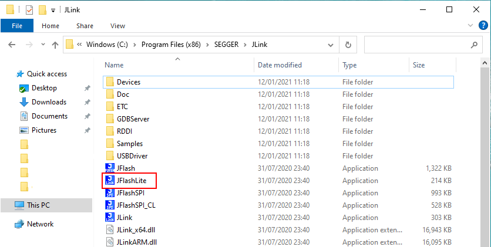
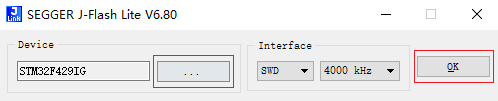
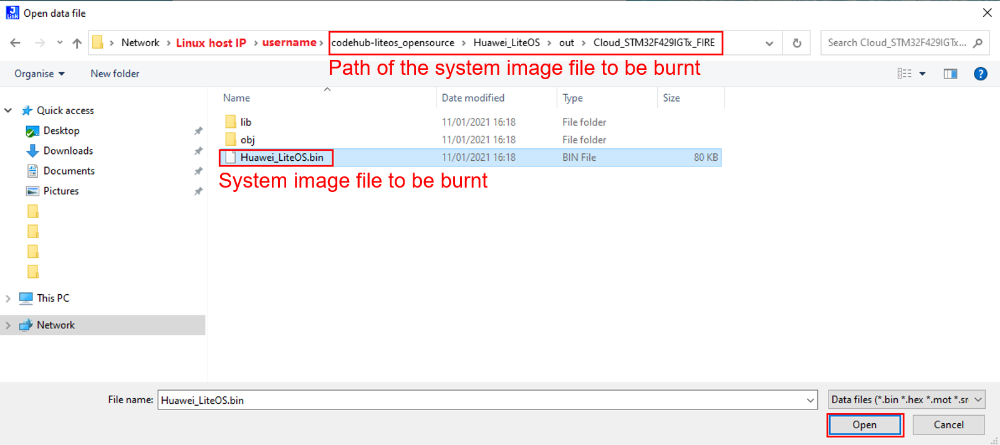
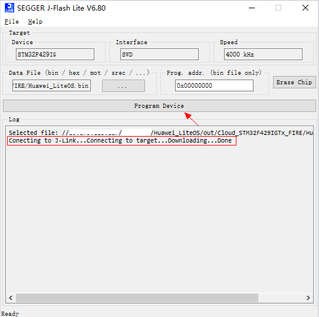

# Burning

1.  Connect the two ports of the JLink emulator to the development board and the Windows host, respectively.
2.  Use a USB cable to connect the USB-to-serial port on the development board to the Windows host.
3.  Run  **JFlashLite.exe**.

    Double-click  **JFlashLite.exe**  in the JLink installation directory, as shown in the following figure.

    

4.  Set the development board information.

    Click  **...**  shown in the following figure and select the corresponding device. The following figure uses STM32F429 as an example to describe how to set the device to STM32F429IG. Click  **OK**  to complete the setting.

    

5.  Select the image file to be burnt.

    Click  **...**, as shown in the following figure.

    

    In the window that is displayed, select the file to be burnt. You can access the built binary file in Linux by using the Samba service. Enter  **\\\\**_IP address_  in the address bar to access the file on the Linux host. Replace the IP address with the actual IP address of the Linux host.

    

6.  Perform burning.

    Click  **Program Device**  to start burning. After the burning is successful, "...Downloading...Done" is displayed in the  **Log**  area, as shown in the following figure.

    

