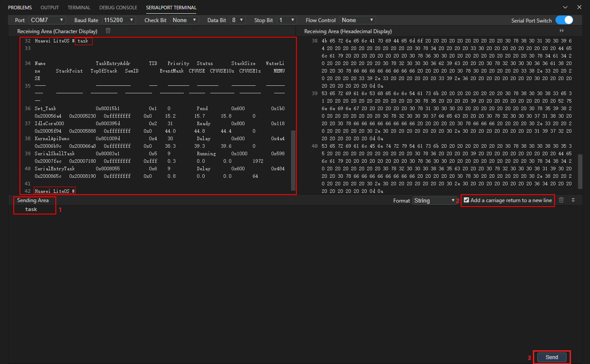
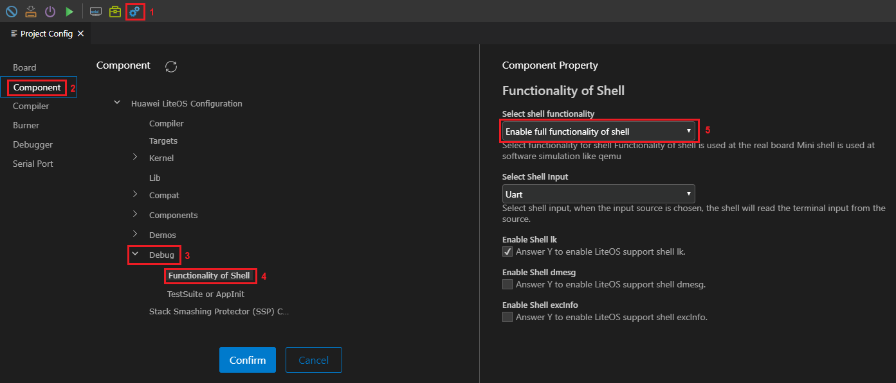

# Running

After the burning is successful, click the serial port terminal icon to open the serial port terminal window, set the port number based on the actual serial port number, and enable the serial port. Press the  **RESET**  button on the development board. The serial port output is displayed. The output in  **Receiving Area**  is the output of Kernel Task Demo after Huawei LiteOS is started, as shown in the following figure:

By default, the shell component of Huawei LiteOS is enabled. You can enter a supported shell command in  **Sending Area**  of the serial port terminal, select  **Add a carriage return to a new line**, and click  **Send**  to run the shell command. The command output is displayed in  **Receiving Area**.  **Huawei LiteOS \#**  is the prompt in the shell CLI window, as shown in the following figure:

For more information about the shell function, see  [Shell User Guide](/shell/doc_en/README_EN.md).

Check whether the shell component is enabled, as shown in the following figure. If yes, the  **Enable full functionality of shell**  option is configured.

