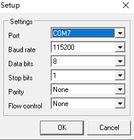
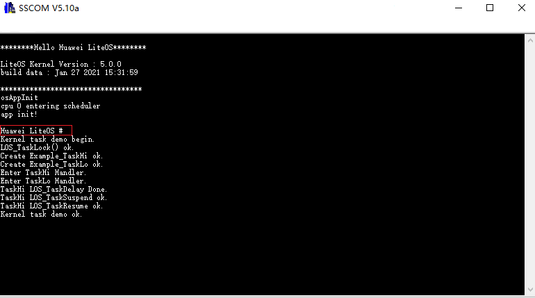
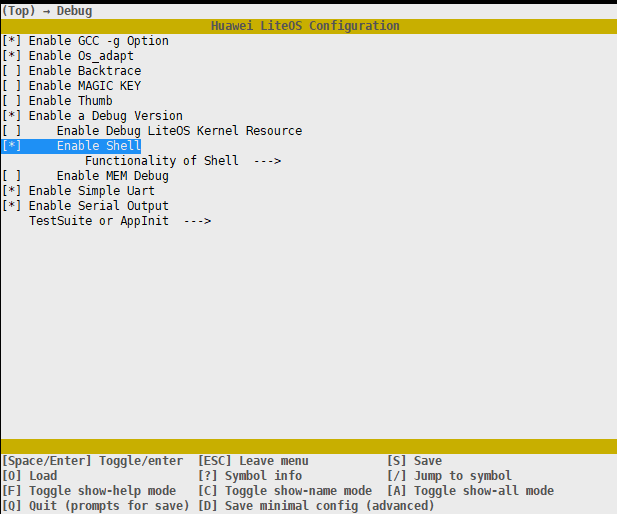

# Running

1.  Open any serial port tool, set the port number queried during  [installing the USB-to-serial adapter driver](setting-up-the-development-environment.md#li19807611163716), and retain the default values for other parameters, such as the baud rate.

    

2.  Reset the development board and run Huawei LiteOS.

    Press the  **RESET**  button on the development board. The serial port displays the information about running the Kernel Task Demo after Huawei LiteOS is started.  **Huawei LiteOS \#**  is the prompt in the shell CLI window, as shown in the following figure:

    

    By default, the shell component of Huawei LiteOS is enabled. You can enter a supported shell command in the serial port tool, select  **Add a carriage return to anew line**, and click  **Send**  to run the shell command.

    For more information about the shell function, see  [Shell User Guide](/shell/doc_en/README_EN.md).

    To check whether the shell component is enabled, run the  **make menuconfig**  command on Linux. If yes,  **Enable Shell**  is configured.

    

