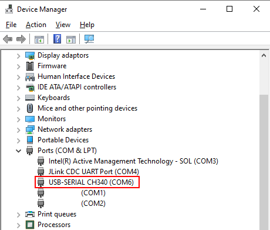

# Setting Up the Development Environment<a name="EN-US_TOPIC_0308937178"></a>

After the build is complete on Linux, access the files on the Linux host through Windows to burn, commission, and run the system image files. Therefore, the development environment includes the build environment on Linux as well as the burning and commissioning tool and USB-to-serial adapter driver on Windows.

-   Set up the build environment on Linux.

    For details, see  [Setting up the Linux Build Environment](../LiteOS_Build_and_IDE_en/setting-up-the-linux-build-environment.md).

-   Set up the Samba service on Linux so that files on the Linux host can be accessed on Windows.
    1.  Install Samba.

        ```
        sudo apt-get install samba
        ```

    2.  Modify the Samba configuration file. 

        Run the following command to open the Samba configuration file:

        ```
        sudo vi /etc/samba/smb.conf
        ```

        Add the following content to the end of the file. Change  **username**  to the username for logging in to the Linux host and  **path**  to the shared directory on the Linux host that can be directly accessed on Windows. Set the path based on the actual requirements.

        ```
        [username]
               path = /home/username
               browseable = yes
               available = yes
               public = yes
               writable = yes
               valid users = username
               create mask = 0777
               security = share
               guest ok = yes
               directory mask = 0777
        ```

    3.  Restart the Samba service.

        ```
        sudo service smbd restart
        ```

    4.  Set a password for the Samba user.

        Run the following command to set the password of the Samba account. Enter the password as prompted.  **username**  indicates the username for logging in to the Linux host.

        ```
        sudo smbpasswd -a username
        ```

    5.  Set the permission on the shared directory.

        Run the following command to set the shared directory configured in step 2 to be readable, writable, and accessible to all users. Change  **/home/username**  to the directory configured in step 2.

        ```
        sudo chmod 777 /home/username
        ```

    6.  Access the shared directory on the Linux host through Windows.

        On the  **File Explorer**  address bar, enter  **\\\\**_Linux host IP address_  to access the Linux shared directory.


-   The burning tool is JLink emulator.

    On the Windows host, download the JLink from the  [official website](https://www.segger.com/downloads/jlink/JLink_Windows.exe). Double-click the downloaded JLink application and install it using the default settings.

-   Install the USB-to-serial adapter driver.

    Use the CH340 driver as an example. On the Windows host, download the USB-to-serial adapter driver from the  [official website](http://www.wch-ic.com/downloads/CH341SER_EXE.html). Double-click the downloaded driver and install it using the default settings. After the driver is installed, use a USB cable to connect the USB-to-serial port on the development board to the Windows host. You can view the port number on Windows Device Manager, as shown in the following figure.

    
